# Everything You Need to Know About AI-Generated Art

   

> **Author**: Ming

---

  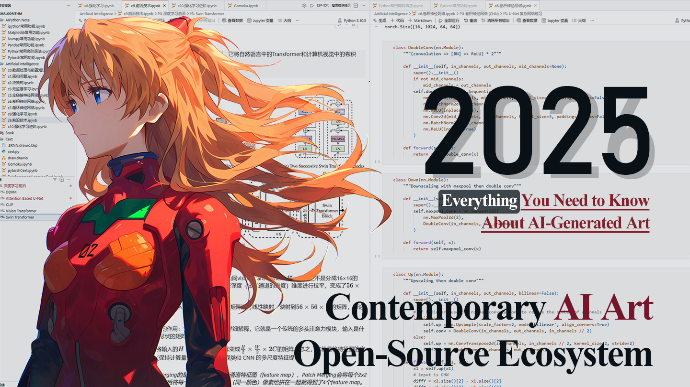

   

  

    
    
    
  

---

  <h3>🌟 [Comprehensive Guide + Packed with Visuals] 🌟</h3>
  
<strong>One Article to Understand What AI Art Has Really Been About Since 2022</strong>

**Many people learning AI art have probably experienced a similar journey:**

At first, you're fired up and determined to master every aspect of AI art systematically;

But soon you get confused—turns out most platform tutorials are just scattered, disconnected pieces with no real structure, and **nearly every single one assumes you already know the basics** 😑

You finally find what looks like a solid tutorial series, only to be bombarded with unfamiliar technical terms and unclear steps that leave you wondering **"why am I doing this?"** —and that feeling of confusion is the fastest way to kill your enthusiasm.

What's worse, new models, plugins, and features keep popping up every few days... **The knowledge updates so fast you can't possibly keep up**. You start feeling restless, your motivation drops steadily, and eventually, you might just have to **shelve AI art completely**.

I know exactly how that feels—and this is coming from someone with a background in AI. I started exploring AI art back in 2022 when Stable Diffusion first emerged, eagerly trying every new feature that came along: one day it was LoRA, the next it was ControlNet… It felt fresh and exciting. But then I had to put it all aside to prepare for my postgraduate entrance exams.

When I returned this March after the exams, I was completely overwhelmed. ComfyUI, Flux, NoobAI-XL, Pony, Qwen-Image, AniWan… I couldn’t keep up anymore 😓. The pace of AI art development has been beyond anything I imagined. And my journey from that point—well, it unfolded just as I described earlier.

**That’s exactly why I’m writing this: to systematically break down what AI art is all about, based on my own learning experience.** This guide is for anyone starting from zero—who wants to learn but doesn’t know where to begin. I’ll provide direction and a clear framework—**not just a fish, but the fishing rod 🎣**.

We won’t dive into complex AI theories, model architectures, or math. Instead, we’ll focus only on what a tool user truly needs to know. Let’s cut through the fog of technical jargon and scattered information and look at AI art from a holistic perspective—so you can truly step across that threshold.

After all, most people learning AI art just want to use it to enhance their creative work—not to train new AI models from scratch.

> The longer I've worked with AI art, the more I realize: **you don't need a deep background in artificial intelligence to use it well**. Just like using any app—you don't need to understand its code or algorithms. **The best way to learn? Learn by doing, and do while learning.** —The key is to experiment often and practice relentlessly.

**Before we dive in, let’s see what today’s open-source AI art and its related technologies can actually achieve:**

| 3D渲染 | 概念稿快速成图 | 多图参考 |
|:---:|:---:|:---:|
| 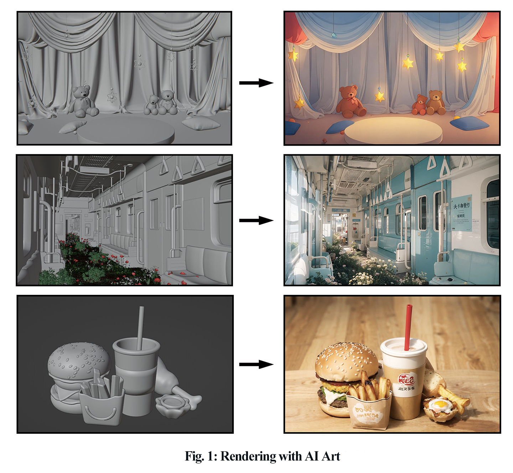 | 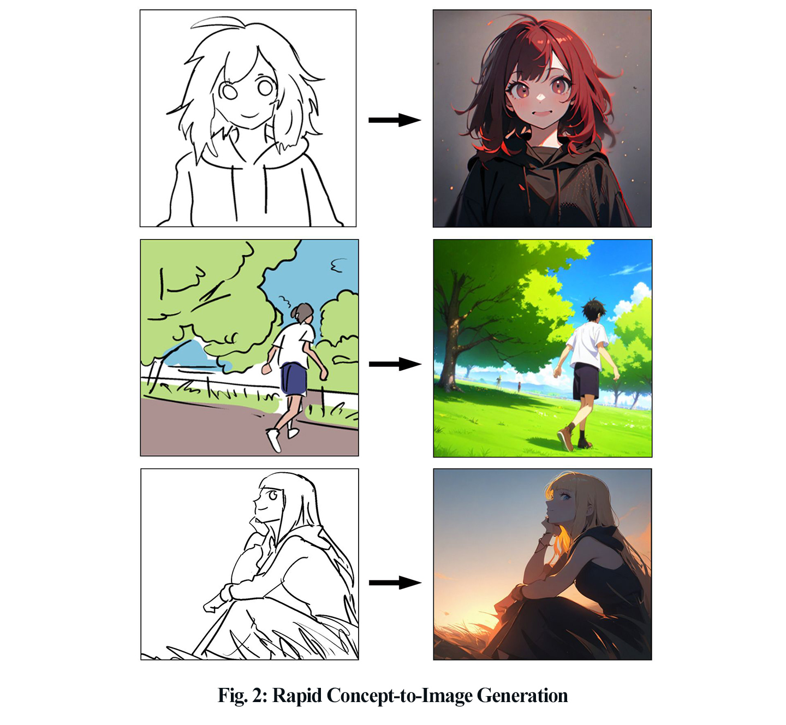 |  |
| **3D Rendering** | **Concept to Final** | **Multi-reference** |

| 图像处理 | 产品图360° | 动漫图360° |
|:---:|:---:|:---:|
| 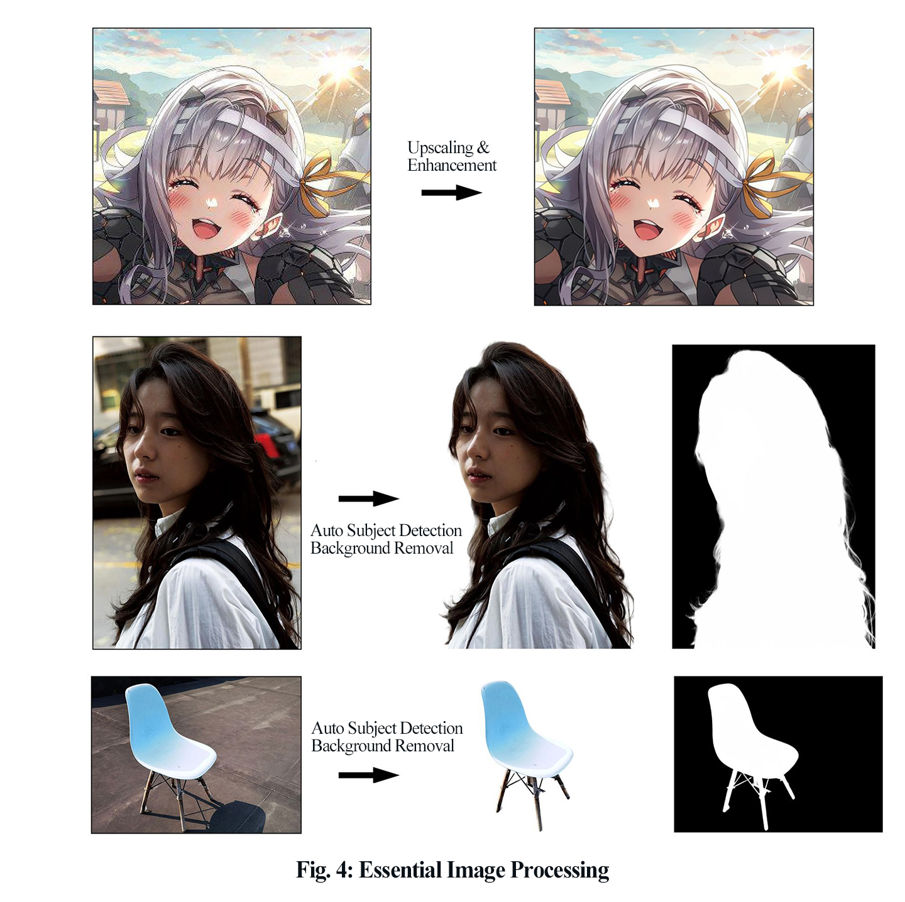 | 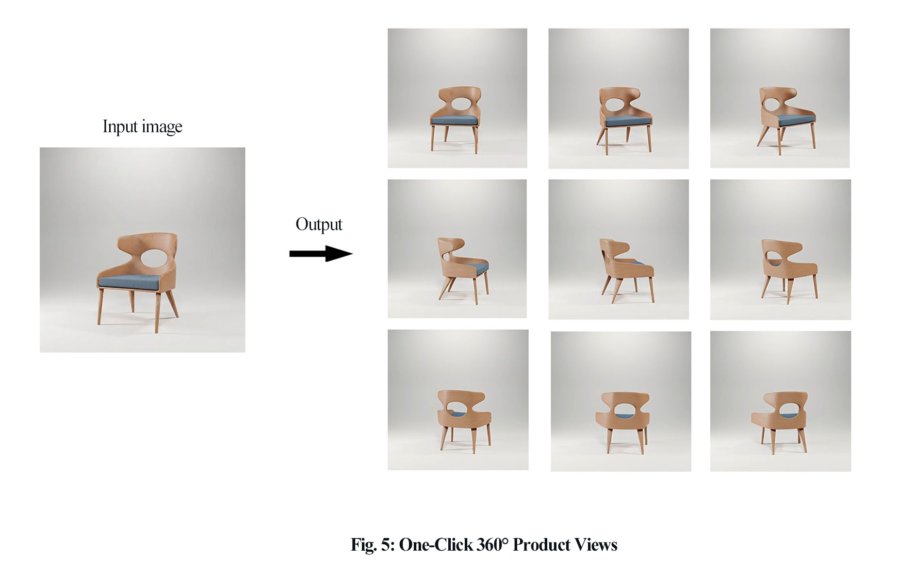 | 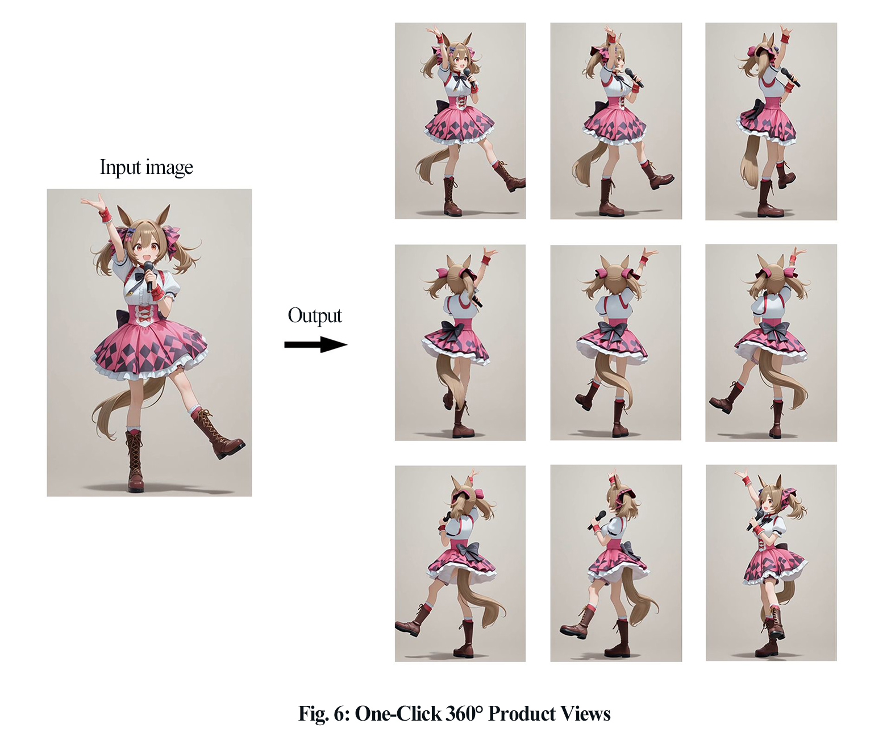 |
| **Image Processing** | **Product 360°** | **Anime 360°** |

| 海报设计 | 文字修改 | 原画拆解 |
|:---:|:---:|:---:|
| 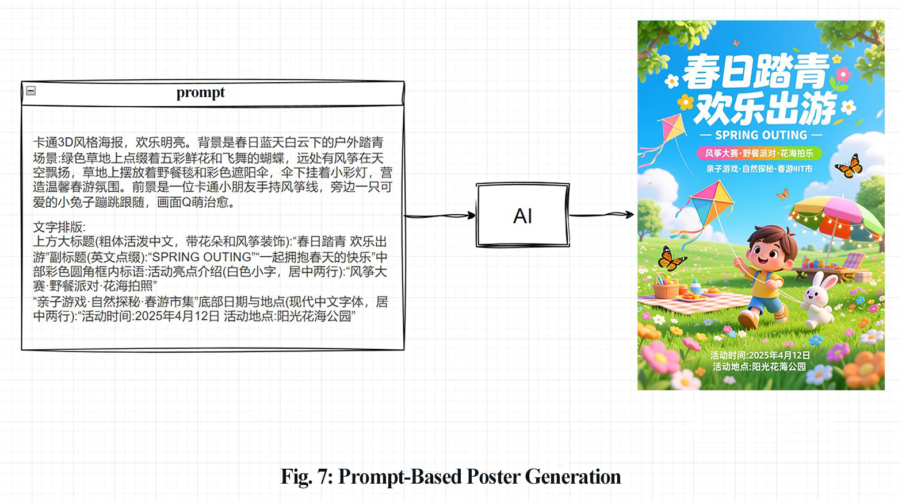 | 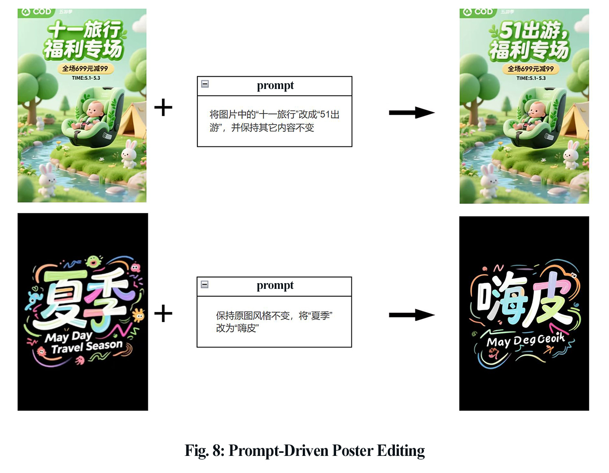 | 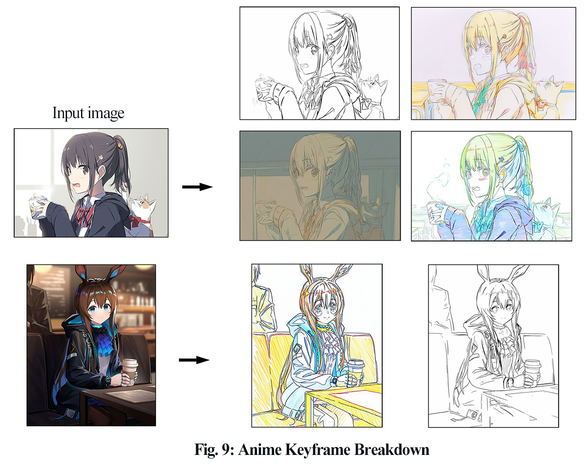 |
| **Poster Design** | **Text Editing** | **Art Analysis** |

| 多风格人物一致性 |
|:---:|
| 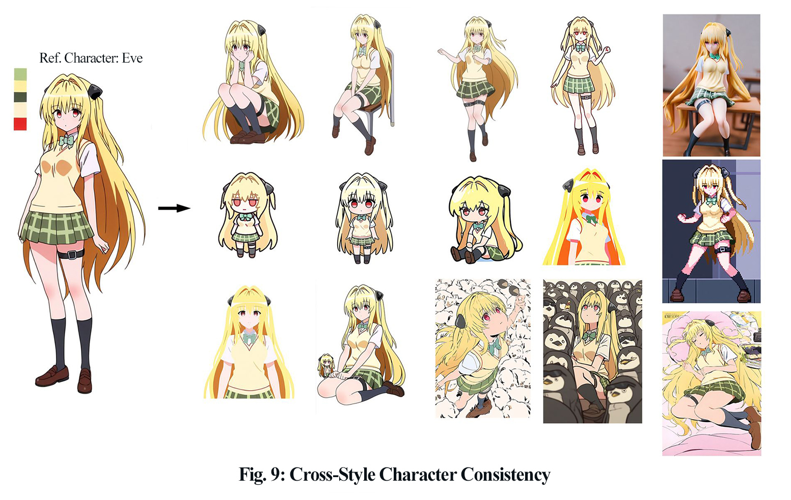 |
| **Multi-style Character Consistency** |

| 首帧图像生成视频 | 首尾帧生成视频 | 3D首尾帧生成 |
|:---:|:---:|:---:|
| <video src='https://github.com/user-attachments/assets/76e412e9-c330-4b24-867b-29024f0b07da' width="90%" controls></video> | <video src='https://github.com/user-attachments/assets/739e9db0-f443-46a3-8599-554d433dbcbf' width="90%" controls></video> | <video src='https://github.com/user-attachments/assets/87458ab6-1d04-4975-883b-8a8a1f782290' width="90%" controls></video> |
| Generate short videos using first-frame images and prompts |Generate short videos using first frames + last frames + prompts | Generate short videos using first frames + last frames + prompts  |

Every effect shown above runs **100% offline on your personal computer**—no internet required—and works with **just one application**.

------

To understand a nation, study its history; to understand a person, review their past; and to grasp a technology’s modern form, trace its evolution. **True understanding only comes by walking the path it traveled.**

This story begins in **late 2022**.
Back then, most had never heard of "AI art" (ChatGPT-3.5 didn’t even exist), and few imagined AI could create art. Public perception saw AI as a purely analytical "science prodigy"—flawless at logic and calculation, but utterly disconnected from creativity or emotion.

**Everything changed in August 2022.**
Stability AI released the **fully open-sourced** Stable Diffusion 1.5 model (SD1.5). Like a master key, this unlocked AI art for everyone. It didn’t just spark a global surge in adoption—it became the **definitive starting point** for all modern AI image generation tools.

> AI image generation isn't new—the tech existed years ago, but early results were underwhelming. Back then, capable tools were either locked away by big companies (closed-source) or produced low-quality outputs that **failed to break into mainstream use**.

For those new to AI: at its core, AI is **math made practical**—lines of code and algorithms. But what truly matters is its *learned knowledge*. Think of AI as a virtual brain built from code. Yet this freshly built brain can't paint anything at first. Why? **Would you expect a newborn infant to draw or write?** Just like that infant, it starts with zero knowledge.

How does it learn? Consider human artists: they master drawing through years of practice, copying masters, and relentless repetition. AI learns similarly. Engineers feed this virtual brain **hundreds of billions of historical artworks**, letting it discover patterns and develop its own artistic style. This demands **massive computational power**—far beyond personal devices. Crucially, **the training data directly shapes the AI’s artistic style**. If you only feed it oil paintings, it won’t generate anime—it’s literally *never seen* such images before. 💡

Of course, all of this depends on one fundamental premise: **the algorithm itself must be powerful enough**. If the model architecture is fundamentally flawed—like building a brain comparable to a gorilla's—then no matter how many images you show it, it will never learn how to draw.

Therefore, a complete "AI model" consists of both the algorithmic structure and the knowledge it has acquired—**think of it as a "virtual brain" plus everything it has learned**. This complete package is what we call a **"large AI model."**

> Today, even the most advanced AI remains what we call **"narrow intelligence"**—designed for specific tasks and still far from matching the general, abstract reasoning capabilities of the human brain.

So, what is the SD1.5 model, then? 🤔
Simply put, it’s essentially a **"virtual brain"** designed by [Stability.ai](https://stability.ai/), combined with the painting knowledge it learned from a massive number of images. The company collected an enormous dataset of images to train this model, giving it the basic ability to generate images.

Back then, the AI art ecosystem was much simpler—far less complex than it is today. Users only needed to load a model and write a few positive and negative prompts to generate an image. That said, the open-source SD1.5 model’s output was still pretty rough—images often looked distorted or didn’t match expectations.
(Back then, the most popular open-source tool was **Stable Diffusion WebUI**, which allowed ordinary users to run AI art models on their own computers.)

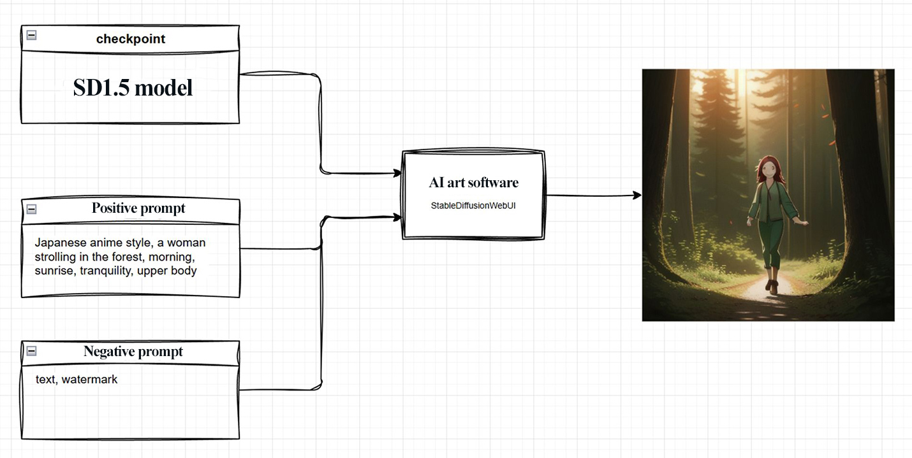
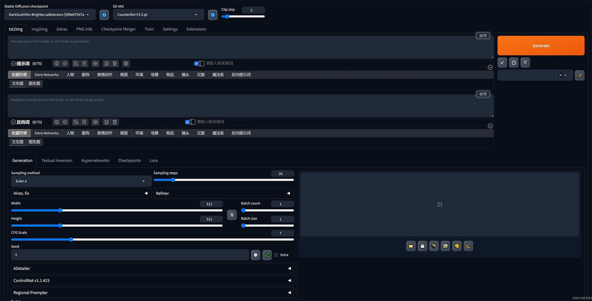

However, since the Stable Diffusion 1.5 (SD1.5) model is **open source**, this means anyone can modify it. **The power of the open-source community is fully unleashed**, and many creators use SD1.5 as a **base model** (or foundation model) to teach it new image styles.

For example, creators can feed SD1.5 hundreds of thousands of anime-style images, training it to generate anime artwork. Once SD1.5 learns this new capability, it essentially "evolves" – the creator can then name and release this customized version, such as an "**Anime Specialist**" model. Others can download and run this tailored model locally. **These customized models typically range from 1.9GB to 5GB in file size.**

As shown in the image below, these AI art **large models** (checkpoints) are all trained from the SD1.5 base model, each specializing in different artistic styles. 🎨

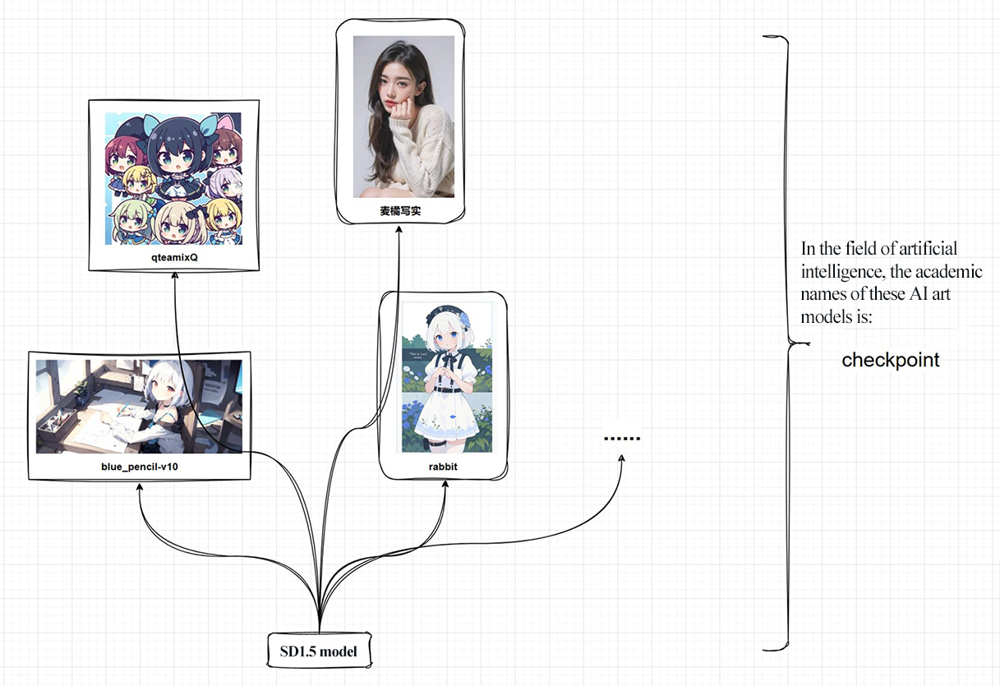

While models fine-tuned on SD1.5 performed much better than the original, they still had a critical flaw: **their output was highly unstable and extremely dependent on prompts.**

To get a decent image, users often had to write very specific, even professional-level descriptions. As you can see in the example below, the required prompts could get intimidatingly long and complex 😱

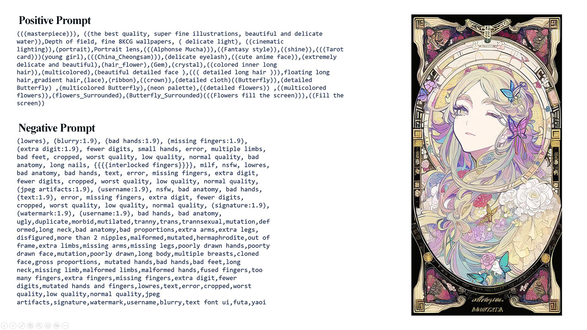

This all goes to show that **early AI art was fundamentally uncontrollable.** It was difficult to make it generate exactly what you wanted. It was precisely this "unreliability" that led the professional art world to initially dismiss it as a toy, unfit for real commercial workflows.

**That is, until ControlNet arrived.**

ControlNet technology truly ushered in an unprecedented level of control for AI art. To put it simply: ControlNet is a model trained based on the SD1.5 architecture. It works as a **plugin** (an additional feature) within AI art software.

Image generation is then accomplished through the **combined effort** of the ControlNet model and the SD1.5 model (often called the checkpoint), working together.

In February 2023, Lvmin Zhang (a Ph.D. candidate in Computer Science at Stanford University) and Maneesh Agrawala jointly published this research, formally introducing the **ControlNet** architecture.

So, what exactly is ControlNet?
**ControlNet is a neural network structure** that controls large AI art models (like SD1.5) by adding extra conditions—such as edge maps, depth maps, pose skeletons, or even simple scribbles.

Think of it this way:
It’s like giving AI art a **steering wheel**, allowing you to precisely control the content, composition, pose, and more—instead of just relying on text prompts and hoping for the best.
The image below shows a typical example of generating a refined image from a simple line art sketch using ControlNet:

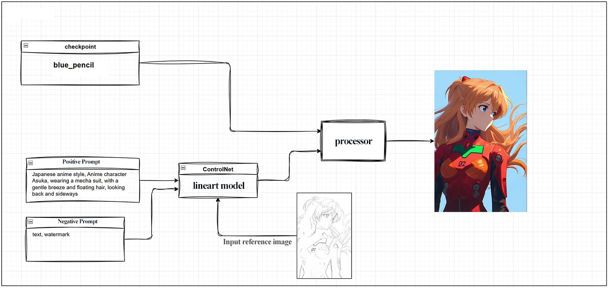

It's also important to know that **ControlNet isn’t just one model—it’s a whole family** of specialized models, each designed for a different type of control task.
The following chart demonstrates the basic control effects of several commonly used ControlNet models:

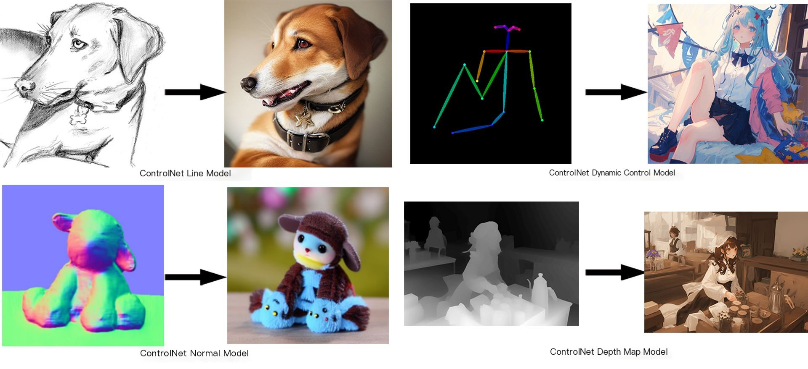

You might be wondering: *Where do these control maps come from?* They can be **hand-drawn manually**—or **generated automatically** using other AI tools. Today, dedicated AI utilities exist specifically for creating control maps (like pose estimation, edge detection, and depth maps), **dramatically lowering the entry barrier**.

You’ve likely heard of **T2I-Adapter** alongside ControlNet. Here’s the truth: **they’re functionally identical**. ControlNet was the groundbreaking pioneer, while Tencent ARC Lab later developed their own version with **identical functionality**—aptly named T2I-Adapter. **Use either one**; both deliver the precise control shown above.

------

As mentioned earlier, training a new model based on a foundation model like SD1.5 typically requires tens of thousands of images. Each resulting model file (checkpoint) takes up at least 2GB of space—not to mention the enormous computational power needed during training, which is simply beyond the capability of ordinary computers.

This creates a significant barrier for many creators. 🧱
For example, if you want a model specialized in generating traditional Chinese ink wash paintings, finding a ready-made one isn’t just inconvenient—it’s often impossible.

What if there were a technique that could learn a specific style from just a few images—one that resulted in small model sizes and required minimal computing power?
**That’s exactly what LoRA (Low-Rank Adaptation) does.**

A LoRA model is very small but allows the AI to quickly learn how to generate specific characters, art styles, or objects—**without retraining the entire massive model**.

Here’s a simple way to understand it:

Think of a large AI model like SD1.5 (the checkpoint) as a **highly skilled but stylistically unformed "painting master"**:

You tell him: *"Draw a girl."*
He can do it, but the face he draws will be random.

Now, suppose you want him to consistently draw **Princess Zelda from /*The Legend of Zelda/***.

**You have two options:**

- **Option A (The Hard Way):**
  You show the master thousands of images of Zelda and have him retreat for months to completely retrain himself into a "Zelda-drawing specialist." This is time-consuming and resource-intensive—essentially equivalent to training a whole new checkpoint.
- **Option B (The Smart Way):**
  Instead of making him relearn everything, you hand him a slim **"Guide to Drawing Zelda" (this is the LoRA)**. This booklet is small and only contains key features: her distinct golden hair, pointed ears, green outfit, etc. After reviewing it, the master combines this with his existing skills and perfectly draws Zelda.
  **The LoRA is that handy little guidebook.** 📘

LoRA is incredibly versatile. Almost any specific object or style you can imagine can be customized using it.

> **Character Consistency (Most Common Use):**
> Train a LoRA model of **yourself**, a specific anime character (like Raiden Shogun), or a celebrity. Then, no matter the scene you generate—*in a café, in space, as a catgirl*—the character’s **distinctive facial features stay perfectly consistent**.
>
> **Art Style Replication:**
> Train a LoRA to master an artist’s signature style (Monet’s impressionism, Studio Ghibli’s animation aesthetic, or a hit game’s art direction). Every image you generate afterward will carry that **exact visual language**.
>
> **Specialized Object/Concept Generation:**
> Create LoRAs for niche subjects: a unique architectural style, a specific garment (like **Hanfu**), or abstract decorative patterns.
>
> **Precision Detail Control:**
> Specialized LoRAs can **enhance image quality**, boost intricate details, or fine-tune color saturation.
>
> ...and many more surprising capabilities you’d never expect. ✨

**LoRA has become an essential tool in AI art thanks to three key strengths:**

🚀 **It's easy to train** – you only need a small set of images to teach it a new style or subject.

💻 **It's lightweight to run** – you don’t need a powerful computer; even a standard PC can handle training a LoRA model.

📦 **It's tiny in size** – LoRA files are much smaller than full checkpoints, typically ranging from just a few dozen to a few hundred megabytes.

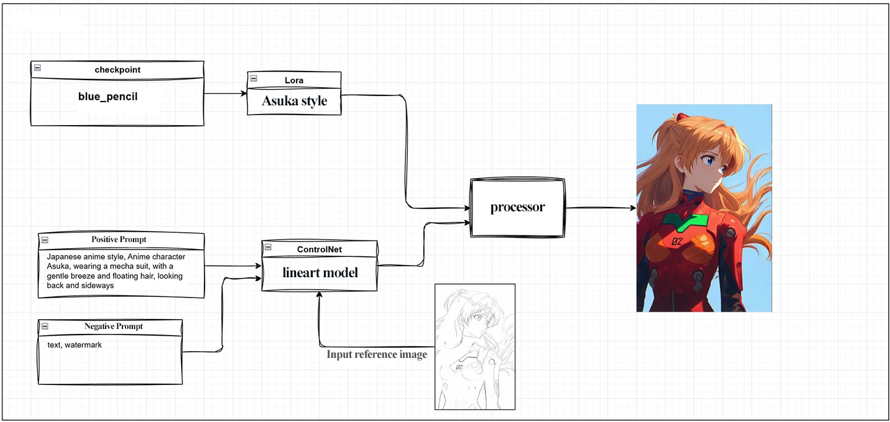

**Beyond the SD1.5 series, other excellent foundational models existed**, such as Midjourney's models and OpenAI's DALL-E 3. While these often produced better-looking images than SD1.5 at the time, SD1.5 had a unique advantage that won over developers and creators: **openness**.

Models like Midjourney were powerful but **closed-source commercial products**. Users could only access them through official, paid channels, with no room for community modification or development. In contrast, **SD1.5 was fully open-source**, fueling global collaboration and innovation.

During this period, many AI art apps and online platforms emerged in China. The vast majority were built by fine-tuning SD1.5, as fully independent, proprietary AI drawing models were still rare.

**SD1.5 stood out for two main reasons:**

1. **Low Hardware Barrier** 🖥️
   It could run—both for training and generating images—on common, consumer-grade NVIDIA graphics cards. Its relatively smaller size made it possible for everyday users to experiment on their personal computers.
2. **The Core Differentiator: Open Source**
   The open-source model attracted a massive community of developers who built new plugins, tools, and pre-trained models, creating a vibrant and rapidly evolving ecosystem.

Besides key technologies like LoRA and ControlNet, the SD1.5 ecosystem includes many other important components and concepts. **Understanding these will give you a comprehensive grasp of how SD1.5 works.**

**Be patient—once you understand the SD1.5 ecosystem, subsequent models like SDXL, Flux, Wan2.x, and Qwen-Image will be much easier to learn.** It's the foundation that makes everything else click into place.

------

**First, what is a VAE?** If you've used AI art tools, you've probably seen this term—you might use it often without fully understanding what it does or why there are so many different VAE models.

To understand VAE, let's start with a practical problem.

A digital image, when zoomed in, is essentially made of countless pixels. Take a standard 1024×1024 color image: with its RGB color channels, it contains 1024 × 1024 × 3 = **3,145,728 pixels**. In computing, each pixel is often stored as a floating-point number, making the memory footprint of a single image very large. Processing it directly is slow, consumes massive GPU memory, and makes real-time generation nearly impossible.

This wasn't just a pain point for AI art—it was a fundamental challenge across computer vision. **The VAE (Variational Autoencoder)** was introduced to solve this.

Think of a VAE as a **"smart compression-decompression algorithm" designed specifically for images**. It's a neural network that compresses a high-resolution image into a much smaller representation (called the **latent space**) with minimal loss of visual information. It can also "decompress" this latent representation back into a final image. **That's its entire job.**

Here's the key insight:
**This is how AI art actually works.** A model like SD1.5 doesn't directly "paint" a full multi-million-pixel image. Instead, it first generates a lightweight representation of the image in the latent space (typically **64 times smaller** than the original). The VAE then decompresses this into the clear, high-resolution picture we see.

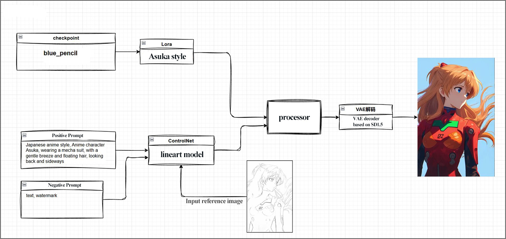

✅ **Thanks to VAE, AI art became efficient and practical.**
The existence of different VAE models also means there are different "compression-decompression" styles—some produce more vibrant colors, others retain sharper details. This gives us another handy tool for fine-tuning our final images.

------

That covers VAEs—now let’s move to **CLIP** and **Embeddings**, the other two workhorses of AI art.

When generating images, writing **prompt text** is essential. But AI doesn’t "understand" English or Chinese. Enter **CLIP**: think of it as an **AI translator** that converts human language into numerical vectors (long strings of numbers) the AI *can* process.

Here’s the catch: human language is limited. Just as *"A lone boat, an old man in straw cloak and hat, fishing alone in cold river snow"* loses its cultural depth in translation, **natural language compresses meaning** for AI. The AI’s internal "visual vocabulary" is vastly richer than what words can express. So text prompts alone only give rough direction—they **can’t control fine details**.

While CLIP translates *text* → AI-readable numbers, other techniques (not covered here) convert *images* → AI-readable numbers. Crucially, **a single image carries far more information than text**. If we encode batches of "bad" images (e.g., distorted anatomy, muddy colors) into a file like `bad_prompt.pt`, we can feed it to the AI as a **negative prompt** to *avoid* those flaws. Files like `bad_prompt.pt` are **Embedding models** (specifically, *textual inversion* embeddings). 💡

> **Heads up:** The use of **Embedding models** has become much less common these days—even for negative prompts. Why? Because **current AI art models are already powerful enough**, with built-in mechanisms for general representation and exclusion. (We’ll dive into that later.)

------

I bet you're already thinking:
**“Why is there so much to learn for something as ‘simple’ as AI art?!”** 😫
Well, the truth is, today’s AI art technology is evolving into a **highly specialized field**. The foundational knowledge you need isn’t just vast—it’s also tightly interconnected.

Everything we’ve covered so far is basically the **2023 technical framework**. But here’s the good news:
**If you have a solid grasp of the SD1.5 ecosystem and its core logic, you’ll be able to quickly get started even with the latest cutting-edge AI art techniques.**

Now, let’s focus on a practical feature in the SD1.5 ecosystem:
**🔧 Inpaint (Local Redrawing)**

**What is Inpaint?**
Simply put—when you generate an image with great overall atmosphere but one annoying flawed detail, you can **draw a mask over that area** and let the AI redraw just that section, while **leaving the rest untouched**.

Take a look at the example below:

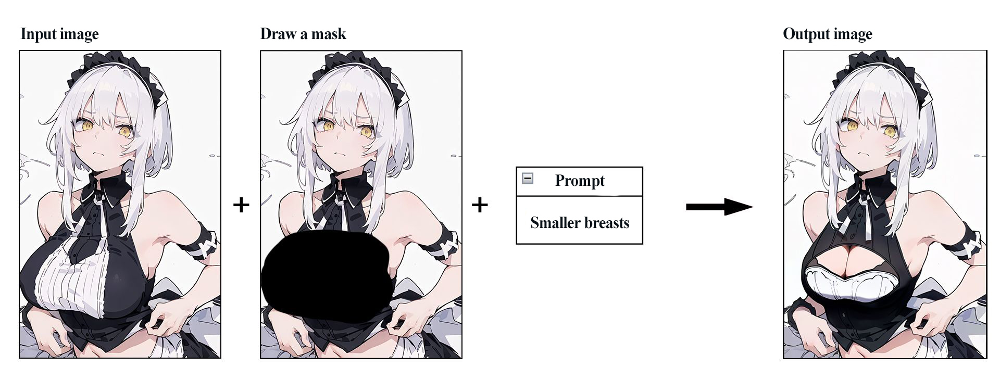

Since AI can generate entire images, **editing just part of an image is trivial**. Inpainting is a foundational technique used for everything from **swapping outfits, faces, or backgrounds** in photos to **removing unwanted objects or people**—making it indispensable for real-world workflows.

Multiple inpainting methods exist today, each with trade-offs (mainstream options include **ControlNet’s dedicated inpainting model**, ComfyUI’s `comfyui-inpaint-nodes`, and the **BrushNet plugin**).

------

Beyond inpainting, **IP-Adapter** deserves special attention. Think of it as a **style transfer tool**: feed it a reference image, and the AI will borrow its visual style and key elements to generate **visually coherent, stylistically consistent** new artwork.

*Example:* You find a uniquely styled illustration online that matches your taste perfectly. But its aesthetic is **too niche** for existing models or LoRAs. With IP-Adapter, simply input that image as reference—no training needed—and the AI instantly replicates its style. **This dramatically lowers the barrier to personalized art creation.** 💡

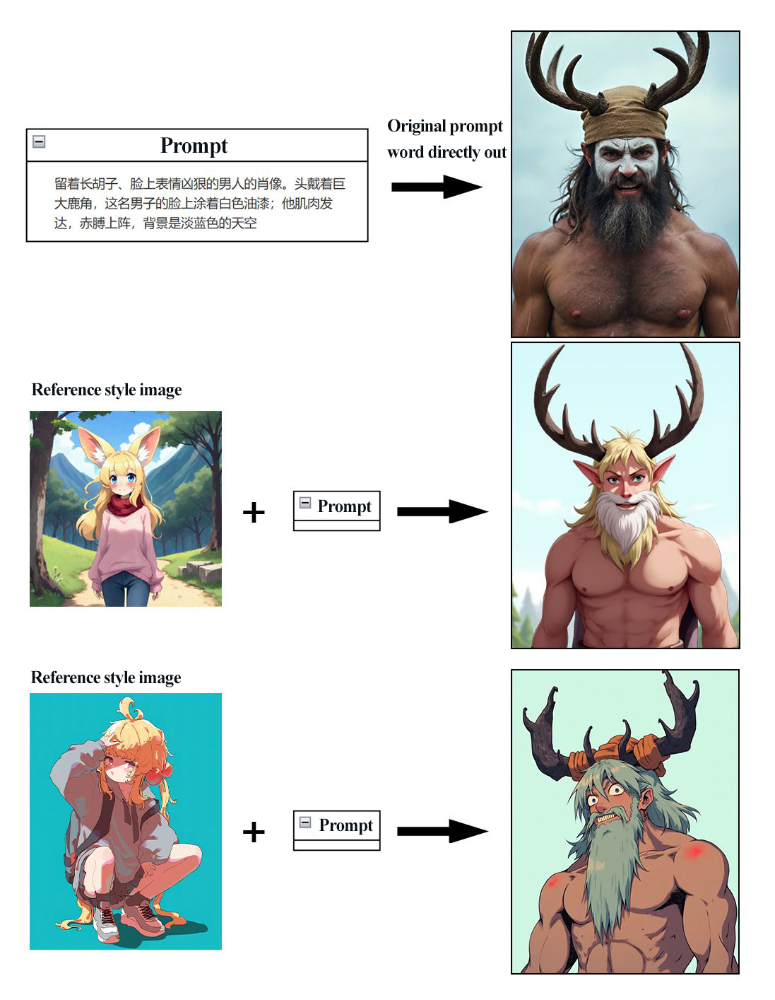

**Now that we've covered auxiliary techniques, let's dive into the core of AI art: How does AI actually "create" an image?**

To understand this, first consider how a human artist works:
They typically start with a composition idea, then gradually sketch outlines, define shapes, apply colors, and add details—a clear, logical, step-by-step process.

**But AI creates in a completely different way.**
It doesn't use paper or brushes—it uses **"noise," "probability," and "latent space."**

A human artist starts with a blank canvas.
An AI starts with **an image full of random noise**.

The essence of AI image generation is a process of **continuously removing noise** and gradually revealing structure.
It's not "drawing"—it's **"evolving."**

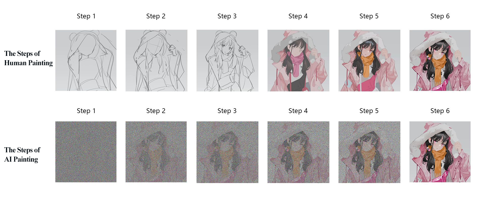

To this day, all AI-generated images and videos we've seen rely on one fundamental technology:
**🔄 The Diffusion Algorithm**

Its underlying principles are complex (and beyond the scope of this article), but the basic steps are as shown in the diagram above:
The AI starts from a state of complete randomness and gradually deduces a meaningful image.

**So how did AI learn to "paint"?**
It was trained on massive datasets—**hundreds of millions of images** were fed into the model.
From these, it learned statistical patterns and visual relationships between pixels—**and that's it**.

The AI doesn’t actually **"understand"** what it's drawing:

- It doesn’t comprehend physics 🧠
- It doesn’t truly understand language 📝
- It has no aesthetic sense or creative intent 🎨

It simply **computes** the most statistically probable image that matches the input description, based on the patterns it learned.

That’s also why AI-generated images tend to be **weak in logic** 🧩.
While they excel at style, texture, and even creative combinations, they perform poorly in tasks requiring strict logical consistency—such as design blueprints, anatomical diagrams, or engineering drawings.
**This remains true today—and it’s not just a matter of having more training data.**

------

**That wraps up our brief overview of Stable Diffusion 1.5 (SD1.5).** You should now have a general understanding of its ecosystem.
**Note:** This article provides a **high-level perspective** on SD1.5's development and technical background. For more detailed and in-depth technical content, you'll need to dive into hands-on use and further learning—but with this foundational knowledge, your future studies will be much more efficient. 🚀

Now, let's shift our focus back to **[Stability.ai](https://stability.ai/)**. Since open-sourcing SD1.5 in August 2022, the company hasn't slowed down—it has continued to release multiple upgraded models while maintaining its **open-source sharing strategy**.

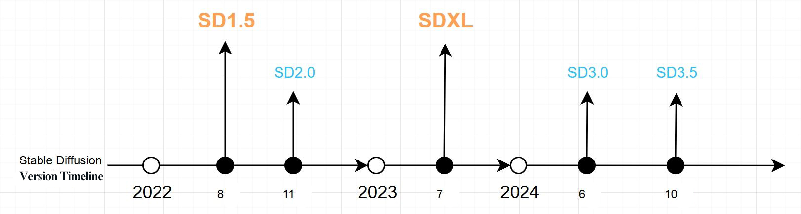

From the timeline above, after SD1.5, Stability.ai rolled out several models, but they didn't gain much traction in the community, and adoption has been relatively limited. Objectively speaking, the company's post-SD1.5 attempts haven't been very successful in terms of reach and scale.
However, there's one exception: **Stable Diffusion XL (SDXL)**, which stands out as a new peak for Stability.ai after SD1.5.

It can be said that **SDXL is the true "successor" to SD1.5**. It not only carries on the open-source and open spirit of its predecessor but also achieves a **qualitative leap** in generation quality and visual performance. After years of ecosystem development and continuous refinement , SDXL has become one of the mainstream professional AI-Generated Art tools . Its comprehensive capabilities far surpass SD1.5, and it is gradually replacing the latter as the new standard for creators and industry applications. In contrast, the SD1.5 ecosystem is gradually fading from view.

There are **fundamental differences in model architecture** between SDXL and SD1.5, which leads to a practical problem: many popular tools in the SD1.5 ecosystem (such as ControlNet , LoRA , IP-Adapter, etc.) cannot be directly applied to SDXL. For this reason, SDXL could only perform basic text-to-image functionality  at its initial release, lacking more advanced control and expansion capabilities — this explains why it received a limited response and low user acceptance in the community when first launched.

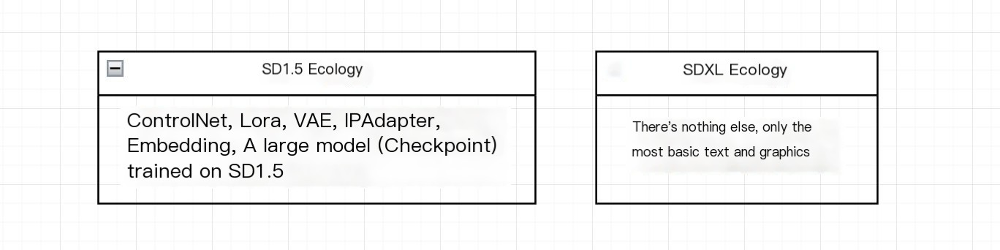

However, with the continuous efforts of the open-source community, various technologies proven highly effective in SD1.5 have been gradually ported and adapted to SDXL . After several years of development, the SDXL ecosystem is now **extremely mature and comprehensive**: it not only covers everything SD1.5 could do but also has expanded into many new technical possibilities.

**In terms of component types**, the SDXL ecosystem is **largely consistent with SD1.5**. Core modules like **ControlNet, LoRA, Embedding, IP-Adapter, VAE, and checkpoints** have all been retained and carried forward.

Now, let's go through a few **key differences between SDXL and SD1.5**.

------

**🖥️ Hardware Requirements**

- To run **SD1.5 locally** for basic image generation, you generally need a GPU with **at least 4GB of VRAM**.
- For **smooth operation with SDXL**, the demands for both **VRAM and computing power increase significantly**.
- If you plan to **train new checkpoints** based on SDXL, the hardware barrier becomes **even higher**.

------

Additionally, [Stability.ai](https://stability.ai/) officially released a **Refiner model** designed to work with SDXL, claiming it improves image quality. However, in practice, many users report **minimal to no noticeable effect** from using the Refiner. **For most purposes, you can safely ignore it.** 

> **(Side note: If you're not interested in anime or illustration-style content, feel free to skip this section and jump ahead.)**
>
> It's widely known that the current top-performing model for generating anime and illustration-style images is **NovelAI's V3 model (referred to as nai3)**. NovelAI is an overseas company focused on AI-driven storytelling and image generation, particularly famous for its anime-style technology.
>
> nai3 can be considered the **current flagship model for anime-style AI art**. The images it generates have almost no noticeable "AI look" and possess a unique, aesthetically pleasing quality, with diverse styles and rich detail. Some even argue that its "artistic skill" arguably surpasses that of many human illustrators, leading to its adoption by several animation studios.
>
> 
>
> 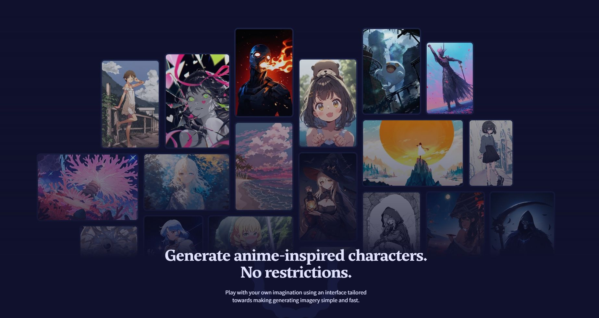
>
> However, **nai3 is a closed-source commercial model** and is not part of the open-source Stable Diffusion ecosystem. Users cannot download or run it locally on their own computers; instead, they must pay to use it on the official website.
>
> So, is there a high-quality, **fully open-source, locally deployable anime-style model**? **Yes, absolutely!** 🎉
>
> The current leader in open-source anime generation is the **illustrious-XL series**. Well-known models like **NoobAI-XL** and **WAI-Manga** all belong to this family.
>
> The most exciting part? The **illustrious series is built entirely on the SDXL ecosystem**. This means if you know how to use SDXL basics, you can directly use these top-tier open-source anime models—they are essentially **checkpoint components within the SDXL system**.
>
> ------
>
> **✨ Quick Intro to the illustrious Series**
>
> For those unfamiliar:
>
> - **illustrious** is a professional anime art model trained on the **SDXL architecture** by the South Korean **Onoma AI Research** team.
> - It was trained using a high-quality **Danbooru tag dataset**.
> - The project is led by **Song Min**, who is also the CEO of Onoma AI.
> - The model's research paper was officially published on **September 30, 2024**, while the v0.1 version was actually released earlier on **September 25** on the open-source platform **Civitai**.
>
> **As of March 18, 2025**, the illustrious model has iterated to **version 2.0**. This generation was trained on **over 20 million anime images**, covering various anime and game character designs up to **August 2024**, as well as styles from many well-known artists.
>
> This means that by simply specifying a character or art style in your prompt, **illustrious 2.0 can usually reproduce it with high quality**. **NoobAI-XL**, meanwhile, is a further optimized version built upon illustrious, delivering **even better performance**.
>
> ------
>
> 🛠️ **Technical Note: Compatibility**
>
> Although the illustrious series is based on SDXL, its architecture and training method have unique characteristics that make it **distinct from typical SDXL derivatives**—you could say it **stands in its own category**.
>
> This leads to an important technical detail:
> Common SDXL control components like **LoRA and ControlNet are not directly compatible** with the illustrious series. You must use **versions specifically designed for illustrious models**.
>
> That said, the illustrious ecosystem itself is now quite mature, so we won’t go into further detail here.
>
> 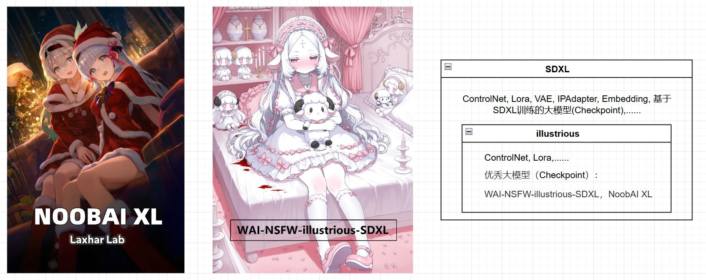
>
> However, **mastering the illustrious series still requires some effort**—you’ll need to carefully study its **official documentation and advanced prompt-writing techniques**.
>
> If your main goal in learning AI art is to generate anime-style images, then **mastering the SDXL ecosystem plus video models like Wan2.x is already sufficient**.
>
> As for other architectures like **Flux** and **Qwen-Image**, they generally **demand much higher hardware resources** and **underperform compared to the illustrious series in anime generation**. These models are more focused on generating **realistic images**, so if you're not specializing outside anime/illustration, you can safely skip them for now. ✅

Many of you may have wondered: Since SD3.0 and SD3.5 were released after SDXL, they should logically be more powerful. So why is SDXL still the mainstream choice today, rather than the newer SD3 series? Behind this question lies a multi-layered story involving **technical roadmap, open-source philosophy, corporate strategy, and team changes**.

First, Stability AI fell into a severe financial crisis, with losses amounting to tens of millions of dollars. The pressure from its cash flow directly impacted the promotion of its technologies and the ecosystem development of new models.

Second, there was controversy over the SD3 series’ license agreement. In short, Stability AI intended to adopt a "semi-closed source" model. This led CivitAI—one of the world’s largest Stable Diffusion resource libraries—to announce a temporary ban on all SD3-related resources, and public trust in the SD3 series collapsed. Once trust is broken, the community’s support also fades away.

Just because of Stability AI’s internal financial troubles, management issues, and potential disagreements over technical direction, the original core Stable Diffusion team (led by Robin Rombach) chose to resign collectively. The leadership vacuum and the loss of core talent severely undermined the company’s stability and R&D progress.

After resigning, the core Stable Diffusion team quickly founded Black Forest Labs. This new company secured **$32 million in seed funding** and focused on advancing generative deep learning models. In August 2024, Black Forest Labs launched its first product: the **FLUX.1 model series**. It excels in image details, prompt adherence, style diversity, and complex scene generation—performances widely regarded as surpassing Midjourney, DALL-E 3, and the Stable Diffusion 3 series.

In a sense, **FLUX represents the "orthodox evolution" that carries on the spirit of SD1.5 and SDXL**. More importantly, it remains committed to open-source principles. As the community continues to release FLUX-based tools (such as ControlNet, LoRA, super-resolution models, and IPAdapter), a new ecosystem centered around FLUX is taking shape—slowly but steadily.

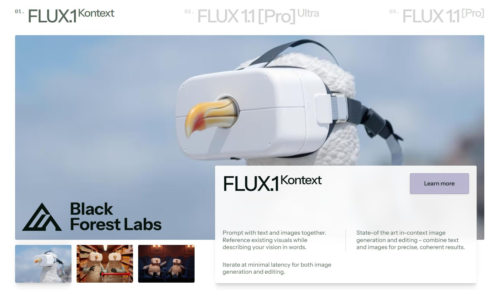

**However, even though FLUX is widely recognized as the most capable generative model overall, it has one major drawback: extremely high hardware requirements.** 🚧

A single FLUX model takes up **16 GB of storage**, and for comfortable image generation, **at least 16 GB of VRAM** is recommended. This means you'll need a high-end GPU like an **RTX 4080, 4090, or the newer 5070Ti, 5080, or 5090**. And that's just for *using* it—if you want to **train new checkpoints or LoRAs** on top of FLUX, only professional studios can typically afford the computational cost.

Because of this, **FLUX's ecosystem is far less developed than SDXL's**, and its growth is relatively slow. It represents the current **technical ceiling** but also highlights that the **democratization of AI still has a long way to go**.

------

**If you plan to dive into the Flux ecosystem, here are key technologies to focus on during your learning process.** These are not only core components of the Flux system but also directly impact practical application and results:

> **Flux Ecosystem: Key Tools & Enhanced Models**
>
> Below is a detailed translation of Flux's professional tools, with **bolded key terms** for clarity and a tutorial-friendly structure (consistent with AI-Generated Art industry conventions):
>
> 1. Local Inpainting & Outpainting: flux1-fill-dev
>
> Unlike SD1.5 and SDXL, which use general-purpose models for inpainting/outpainting, Black Forest Labs has **developed a dedicated large model specifically for this task**: **flux1-fill-dev**. Weighing in at approximately 16GB, this model delivers greater precision in **coherence of details** and **spatial logic**.
>
> 2. Style Transfer Tool: Redux
>
> While IPAdapter already enables style reference within the Flux ecosystem, the official team launched a more specialized style transfer model—**Redux**. It excels in commercial-grade image generation, making it ideal for e-commerce scenarios such as:
>
> - Model outfit changes
> - Product retouching
> - High-quality still life photography
>
> However, Redux has a **higher learning curve**; significant debugging experience is required to unlock its full potential.
>
> Together, flux1-fill-dev and Redux are called **Flux Tools**—essentially Flux’s "enhancement suite" for professional applications.
>
> 3. Boosting Photorealism: Flux Krea Dev
>
> Addressing community feedback that "Flux outputs have too strong an 'AI look'", Black Forest Labs released **Flux Krea Dev** (also ~16GB). This model achieves remarkable improvements in the naturalness of **lighting, textures, and composition**, producing results closer to real photography and greatly enhancing practicality.
>
> 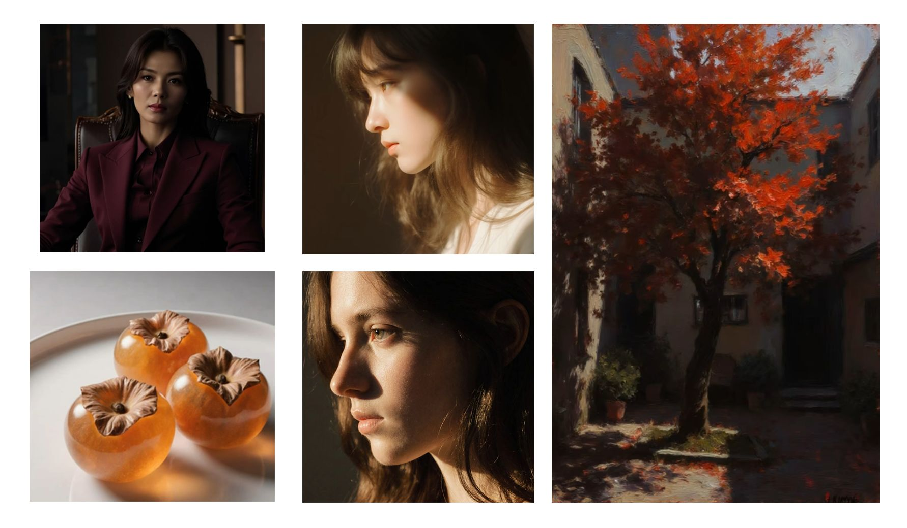
>
> 4. Everything Transfer Technology: ACE++
>
> Developed by Alibaba Tongyi Lab, ACE++ is an open-source set of LoRA models based on the Flux architecture (commonly known as "**Everything Transfer**" in Chinese). It includes three core modules:
>
> - Portrait Transfer
> - Regional Object Addition/Removal
> - Object Feature Replacement
>
> ACE++ significantly expands Flux’s flexibility and **control precision** in content editing.
>
> 
>
> 5. Intelligent Image Editing: Flux Kontext Dev
>
> This is a function-oriented instruction-following model. Think of it as "a photo retoucher that understands natural language"—simply describe your modification needs in plain English (e.g., "remove watermarks", "adjust the tone to warm", "change the sky to night"), and it will intelligently identify image regions and execute the edits. It supports a wide range of use cases, from simple watermark removal to complex multi-object replacement.

If you intend to use **AI art** for actual creation or production, I still highly recommend the open-source ecosystems mentioned earlier, such as Stable Diffusion and Flux. They are not only more mature in terms of model performance, controllability, and plugin ecosystems, but more importantly – they are free, open, and continuously iterated by developers worldwide 🌟.

*(Added in December 2025: Recently, closed-source commercial AI art products have been gaining significant momentum. Models like Sora 2 and Vidu Q2 (for video generation) as well as **Nano Banana Pro** (for image editing) have not only seen huge improvements in output quality but also become much simpler and more intuitive to operate. Most of them integrate powerful current language models – users just need to type a few sentences and adjust some settings to quickly generate highly demand-matching images or videos, resulting in a remarkable efficiency boost. Even if these models go open-source in the future, their massive parameter counts mean they will hardly run smoothly on consumer-grade GPUs – in other words, we still can't avoid the reality of **"paid usage"**.*

*Honestly, as a blogger who has followed the AI art field for a long time, I'm starting to feel a touch of confusion. Currently, open-source solutions represented by ComfyUI are flexible and controllable, but they are mostly limited to relatively simple tasks. For complex needs like advanced image editing and video generation, it's almost impossible to implement them on local devices. This capability gap makes me feel uncertain about the future competitiveness of the open-source path.)*

Next, I will introduce some **Chinese open-source AI art models**.

For instance, the **Qwen-VL (also known as Qwen-Image) series from Alibaba's Tongyi Qianwen team** doesn't just produce high-quality images. It truly excels in **visual-language understanding and reasoning**, demonstrating powerful cross-modal capabilities. Being fully open-source and free for commercial use, it significantly lowers the barrier to entry for developers.

But the real standout is the **Wan (万) series video generation model from Alibaba Cloud's Tongyi Wanxiang team**. Focused primarily on video generation, this model quickly became a hot topic in the international academic and developer communities after its open-source release.

> **📝 Note (Added Dec 2025):** Recently, Alibaba open-sourced an image generation model called **Z-image** that's quite impressive. 🚀 Its model size is kept very compact, with a relatively lean parameter count, yet it delivers outstanding results—even rivaling leading models like **FLUX.2**. It also supports text-to-image generation. While FLUX.2 is powerful, its large size can feel a bit "bloated." Z-image gives me fresh hope: we might soon achieve **compact yet powerful AI models** that don't sacrifice quality but are more lightweight, user-friendly, and accessible for everyone.

Next, let's briefly introduce **Qwen-Image** and **Wan**.

First, **Qwen-Image** is the first foundational image generation model launched by Alibaba's Tongyi Qianwen team. You can think of it as **"China's answer to FLUX"**—it shares a similar overall architecture and performance profile, with comparable strengths and weaknesses. However, it has some unique advantages:

- **Native Chinese Support**: It accepts prompts directly in Chinese. This means the model itself understands Chinese semantics, leading to generations that are more aligned with the Chinese context. You no longer need to translate Chinese into English first.
- **Powerful Text Rendering**: Qwen-Image excels at generating images with clear and accurate text. You can use it to create various artistic fonts. Figures 7 and 8 at the beginning of this article were created by Qwen-Image, which supports **Chinese characters, English, and numbers**.

Some time after releasing Qwen-Image, the Tongyi Qianwen team launched another model called **Qwen-image-edit**. This can be considered China's **first image editing model similar to "FLUX Kontext"**. Its key differentiator remains its superior text rendering capability within edited images.

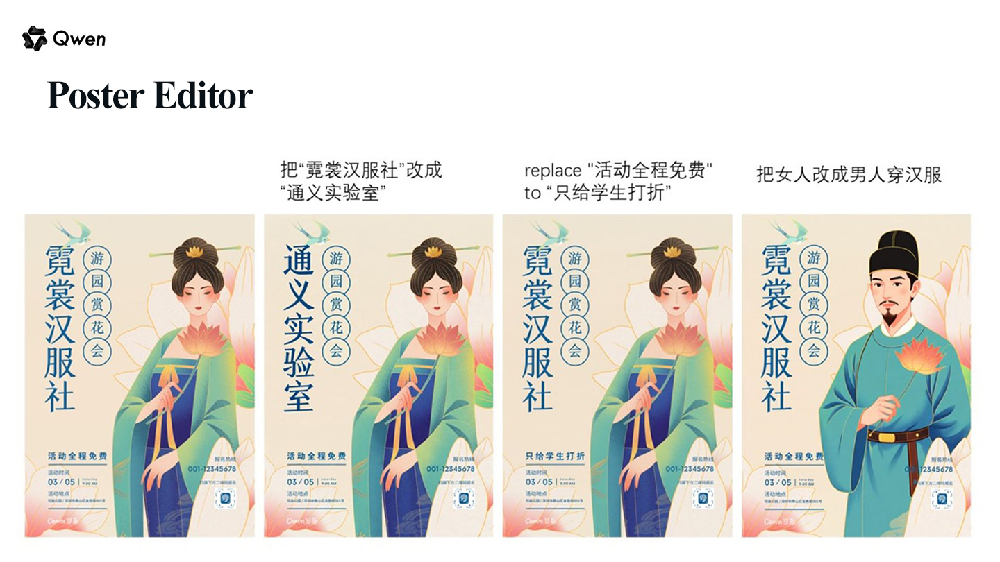
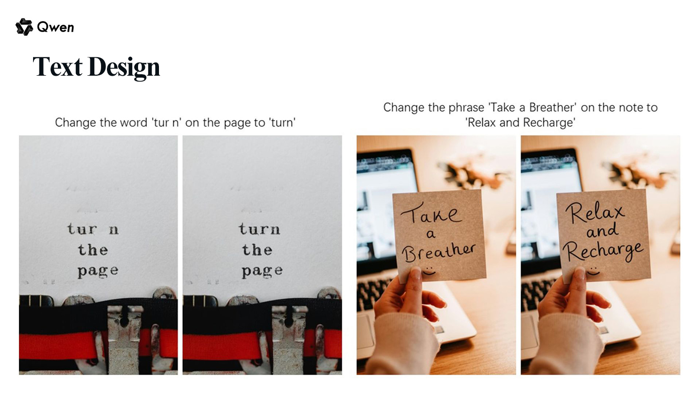

However, it’s important to note that **Qwen-Image**, as a newly released model, still has an ecosystem that’s being gradually improved. Additionally, it has high demand for computational resources. Therefore, unless you have specific needs for text accuracy, it’s still generally recommended to prioritize the **SDXL or Flux series** – these have more mature ecosystems and broader support.

Next, let’s introduce the **Wan video model**. Strictly speaking, **AI video generation** has entered a separate technical track, which differs from the static generation logic of AI art. For this reason, I won’t go into too many details here, only sharing a few interesting points I’ve observed.

Before **Wan** emerged, many video generation models had already appeared on the market. But they often had limitations in terms of **coherence, clarity, or semantic restoration accuracy**. Against this backdrop, the launch and full open-source release of Wan marked a crucial breakthrough. Thanks to its excellent comprehensive generation capabilities, many enterprises and studios have adopted it as a base model for secondary development and practical use.

Currently, the Wan series has two models: **Wan 2.1** and **Wan 2.2**. Both excel at generating **realistic-style videos**, but their performance in the 2D anime (ACG) field is not as strong. Through extensive testing, I found that **Wan 2.2** is particularly suitable for creating 3D animations. However, when generating 2D flat anime, it tends to produce styles like **Live2D or skeletal animation** – not the typical style seen in Japanese anime series.

If you've been following AI anime video generation, you might have heard of **Bilibili's self-developed Index-anisora model**. It's a video generation model specifically designed for anime content, capable of producing **start-to-end frame animation, dynamic comics, image-to-video, and skeleton animation**, among other features. However, the first version didn't perform very well and failed to make a big splash in the community.

Later, the team retrained it using the **Wan model** and Bilibili's vast repository of anime data. The resulting **v3.1 version showed significant improvement**, clearly outperforming the initial release. But it has one major drawback for the average user: **it requires an extremely high-end computer setup**. Even a hypothetical RTX 5090 wouldn't be able to run it—you'd need a professional-grade compute card with massive VRAM.

<video src='https://github.com/user-attachments/assets/06743d3e-4a46-4185-954f-3bc9be80421e' 
       controls 
       style="
           border-radius: 8px;
           border: 2px solid #ddd;
           max-width: 88%;
           background: #000;
       ">
</video>

So, it's clear most of us won't get to experience Index-anisora. But another video model that really caught my eye is **AniWan2.1**.

Trained by Japan's **hakoniwa** based on **Wan2.1**, AniWan2.1 is a model specialized in generating anime videos. Compared to Index-anisora, its **model size and hardware requirements are much more friendly**, similar to those of the FLUX model. Yet, its output quality is remarkably impressive—in my opinion, **not too far behind Index-anisora**. In fact, **every anime video showcased in this article was generated by AniWan2.1**.

| Video 1 | Video 2 |
|:---:|:---:|
| <video src='https://github.com/user-attachments/assets/cfafa952-840a-4529-ad0e-0d715bb12587' controls style="border-radius: 8px; max-width: 95%; box-shadow: 0 4px 12px rgba(0,0,0,0.15); background: #000;"></video> | <video src='https://github.com/user-attachments/assets/d44bf816-bf6c-4f3b-971c-1cc53a37654f' controls style="border-radius: 8px; max-width: 95%; box-shadow: 0 4px 12px rgba(0,0,0,0.15); background: #000;"></video> |
| **Video 3** | **Video 4** |
| <video src='https://github.com/user-attachments/assets/e984b9f4-b7f3-48e9-b232-ae12d0100b87' controls style="border-radius: 8px; max-width: 95%; box-shadow: 0 4px 12px rgba(0,0,0,0.15); background: #000;"></video> | <video src='https://github.com/user-attachments/assets/e4b4cc8d-2ec2-487c-9bf2-433f243c5b6e' controls style="border-radius: 8px; max-width: 95%; box-shadow: 0 4px 12px rgba(0,0,0,0.15); background: #000;"></video> |

The above covers the **key developments** in AI art since 2022. Beyond the models and ecosystems mentioned earlier, there are actually many other notable projects – such as OpenAI’s Sora, HiDream, Cosmos, OmniGen, Tencent Hunyuan, ToonComposer, and KLing. However, I didn’t elaborate on each one, either because they are fully closed-source, their performance doesn’t reach the top tier, or their ecosystem openness is limited. After all, this article has always focused on the forces that truly drive **openness and innovation** in the industry.

At this point, many readers may have a practical question: With so many models, how do you actually get started using them?

To run the aforementioned AI art models smoothly on your local device, your computer needs to meet two basic requirements: first, a **Windows operating system** (Linux works too); second, a **capable NVIDIA graphics card** – yes, the larger the VRAM, the smoother your experience will be 💻.

For software, there are currently three mainstream options: **SD-WebUI**, **SD-Forge**, and **ComfyUI**. Many people recommend beginners start with SD-WebUI, as it’s indeed more beginner-friendly. But since you’ve finished reading this article and already have a basic understanding of the overall AI art ecosystem, I actually suggest you try ComfyUI directly.

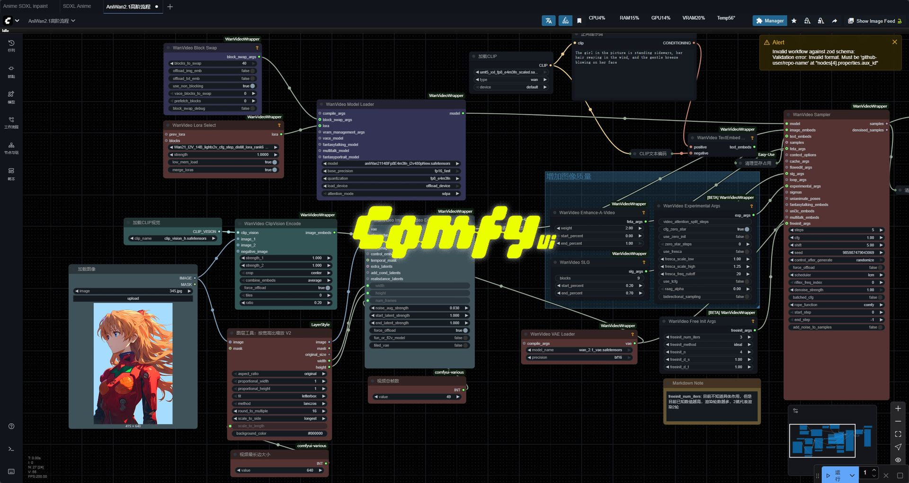

**ComfyUI** is more than just a tool—it’s a highly customizable, widely compatible "**model container**" (most open-source AI art models worldwide can run on it). All the sample images and videos in this article were created using ComfyUI.

I know many people, when opening ComfyUI for the first time, are intimidated by its node-filled, circuit-like "**workflow**" interface. But don’t worry—you can think of it as a "programming-style matching game": visually complex but logically clear. More importantly, you don’t need to build complex workflows right from the start—many advanced node groups are actually unnecessary.

In the future, when you’re browsing the internet and come across an impressive AI-generated image, your first questions shouldn’t be "Which software was used to create it?" or "Which model was used?" Instead, you should ask: "**Which ecosystem does it belong to—SD1.5, SDXL, Flux, or others?**"

If you want to learn, pick one ecosystem and master it well. Don’t switch between learning SDXL and going back to Flux randomly 💡.

------

**Feeling the urge to dive into learning AI art right now?**  Not so fast! Before you get swept up by the hype, take a breath and ask yourself one thing: **Do I really need to learn AI art deeply?**

From my own experience, learning AI art involves **much more than just "prompt + generate"**. It’s a process that consumes **a tremendous amount of time, patience, and hardware resources**. Most of the time, you’re not creating—you’re repeatedly **downloading models, debugging components, managing version compatibility, and tuning parameters**. The learning curve is steep, and even after mastering it, without a real application scenario, it’s easy to fall into **"skill stagnation"**.

Take me, for example: even though I’m familiar with all kinds of models and frameworks, my lack of artistic foundation makes it hard to turn AI art into truly valuable output. The only thing it’s brought me is the ability to write articles like the one you’re reading—earning a bit of traffic and ad revenue. And clearly, **that’s not why most people start learning AI art**.

So, who is actually the best fit for systematically learning AI art? Is it people who can’t draw?
**Quite the opposite.**

The ones who should truly master this technology are **professional artists and art practitioners with solid artistic skills**. Today’s AI art systems are already incredibly powerful—it’s time to stop looking down on them. Instead, see them as **high-productivity auxiliary tool** that can unleash astonishing creative potential.

The value of AI art lies **not in replacing humans, but in empowering them**.
**AI-generated art is human artistic creation in the age of artificial intelligence—where the artist remains at the heart of it all.**

**An artist skilled in using AI technology will be greatly empowered.** What is AI good at? It excels in **high-efficiency, high-precision style imitation, element generation, and image rendering**. But what does it lack? It lacks **logic, narrative, emotion, and the organic, story-driven interactions** between "people and scenes" or "people and people"—abilities that remain uniquely human.

Currently, most outstanding pure AI works are still concentrated in **single-character illustrations, stylized scenes, or special effects visuals**. However, when it comes to **multi-character interactions, compositions with dramatic tension, or narrative layers**, pure AI-generated images often struggle to deliver.

But this doesn’t mean **AI art is worthless**. In fact, it has already been adopted into workflows across industries like **game development, advertising design, and film concept art**, handling tasks such as **initial inspiration exploration, atmosphere sketching, and element generation**. The tool itself isn’t good or bad—**what matters is how you use it**.

I think many artists worry about others labeling their work as AI-generated. My take? **Don’t fixate on everyone’s opinion**. Some people insist that "AI output = worthless" and even look down on it. Honestly, those who constantly accuse works of being AI-made in comments are similar to folks obsessed with spotting "clipping" in 3D art—they might not grasp the technology’s logic and just want to flaunt their "cleverness". 

If a piece of art truly moves people, then whether it’s hand-drawn or AI-assisted, **it has already achieved its purpose**. To wrap up, I’ll leave you with a quote from Gombrich: **"There is no art, only artists."**
