# 关于AI绘画，你想知道的都在这里

    
> Ming
---

  

---

  <h3>🌟 [万字长文+超多插图] 🌟</h3>
  
<strong>一篇文章，让你了解从2022年开始到现在的AI绘画究竟是怎么一回事</strong>

**相信很多人在学习AI绘画的过程中，都经历过类似的心路历程：**

一开始满腔热血，决心要系统掌握AI绘画的所有知识；

随后却陷入困惑，因为发现各平台的教程几乎全是碎片化的内容，不成体系，而且几乎每一篇都默认你已经具备相关基础😑

好不容易找到一个看起来不错的系列教程，跟着学的时候却冒出大量陌生术语，操作步骤也让人不明所以——这种“不知道为什么要这么做”的状态，最是消耗热情。

更关键的是，每隔几天就有新模型、新插件和新功能冒出来…知识更新速度快到根本追不上，根本学不完。于是慢慢变得浮躁，学习动力不断下降，最终可能只好把AI绘画“束之高阁”。

这一切我都深有体会——尽管我还算有一些人工智能相关的基础。我从2022年StableDiffusion刚兴起时就开始接触AI绘画，几乎是出一个新功能就跟进一个：今天新出了一个叫Lora的功能，就去学Lora，明天出了ControlNet，就去学…那时觉得既新鲜又有趣。后来因为考研，不得不暂停。等到今年三月考研结束，再回来看时，整个人都愣住了：ComfyUI、Flux、NoobAI-XL、Pony、qwen-image、AniWan…已经完全看不懂了😓。AI绘画的发展速度，远远超乎想象。之后我的心路历程，就正如上文所描述的那样。

**所以这篇文章的目的，就是基于我自己的学习经验，为大家系统梳理“AI绘画”到底是怎么一回事，让一个完全零基础想学AI绘画但不知从何下手的人提供一个方向和大纲，授人以渔而不是授人以鱼**——不涉及复杂的人工智能专业知识，也不讲模型架构和数学原理，只聚焦于一个工具使用者真正需要知道的内容。帮大家拨开专业术语和零散信息所构成的“迷雾”，从全局视角理解AI绘画的知识结构——让你真正一脚跨进这道门槛。

毕竟，大多数人学习AI绘画，只是想用好这个工具辅助自己的创作，而不是要去开发训练新AI。

> 其实学得越久我越意识到：用好AI绘画，根本不需要多深的人工智能背景。就像你用一款App，并不需要懂它的代码和算法。**最好的学习方法就是“在用中学，在学中用”**——关键是多尝试、多实践。

**在开始正文之前，让我们先来看看目前AI绘画及其衍生技术究竟达到了什么样的程度**

| 3D场景渲染 | 概念稿快速成图 |
|:---:|:---:|
| 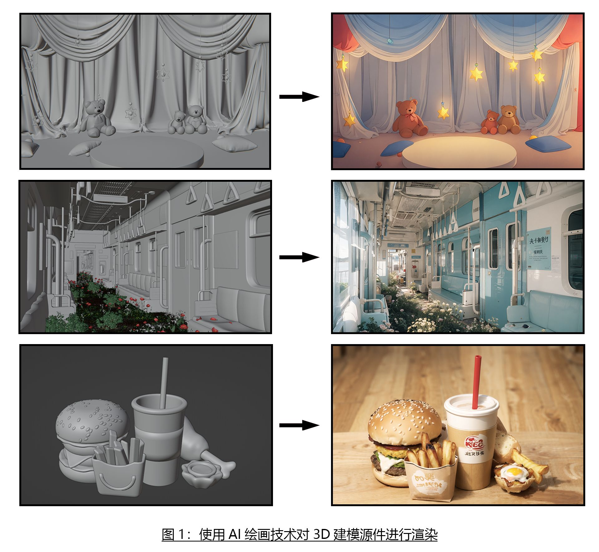 | 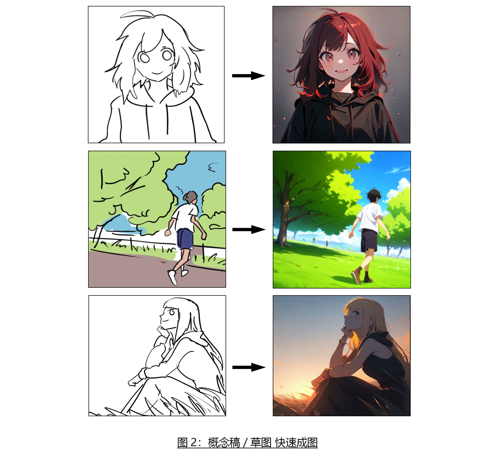 |

| 多图参考融合 | 智能图像处理 |
|:---:|:---:|
| 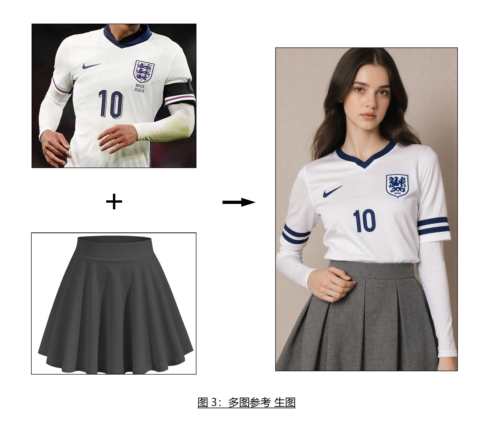 | 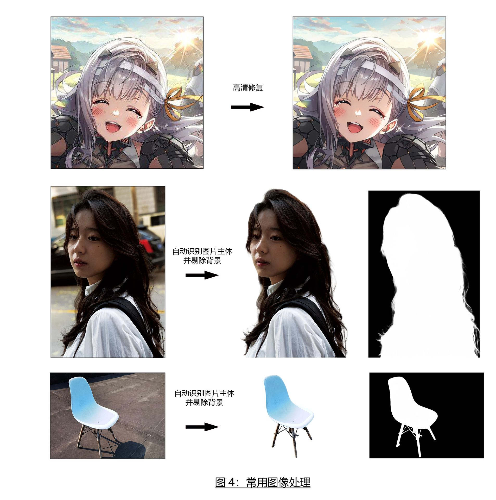 |

| 产品3D展示 | 动漫风格转换 |
|:---:|:---:|
| 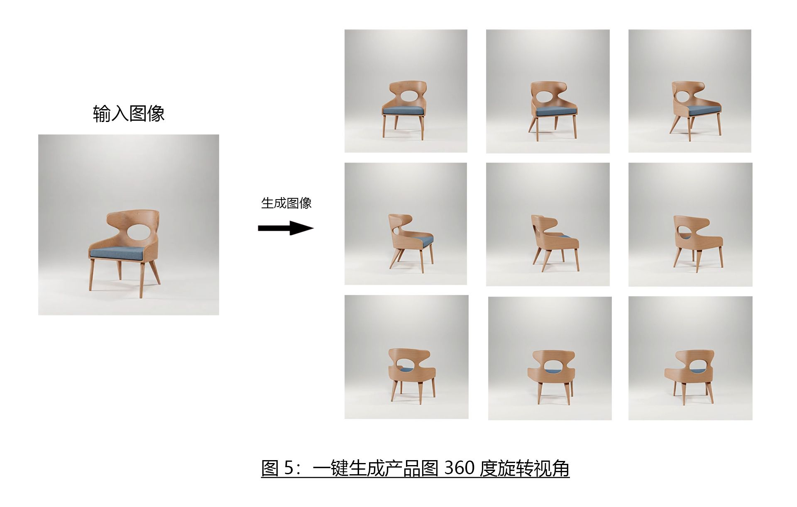 | 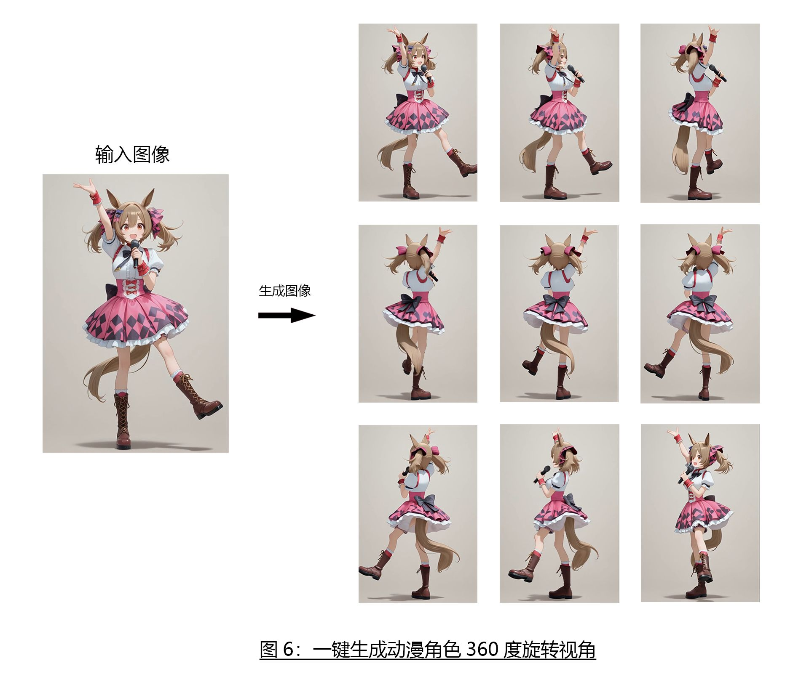 |

| 创意海报设计 | 智能文字修改 |
|:---:|:---:|
| 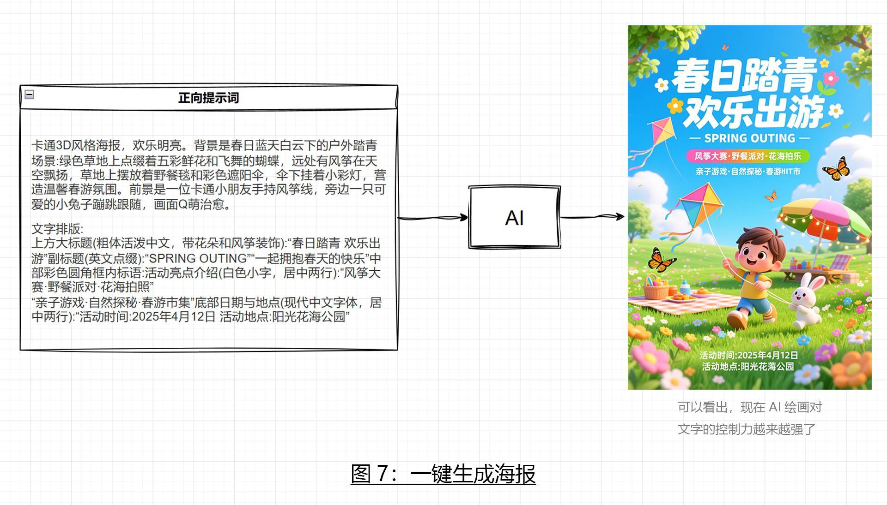 | 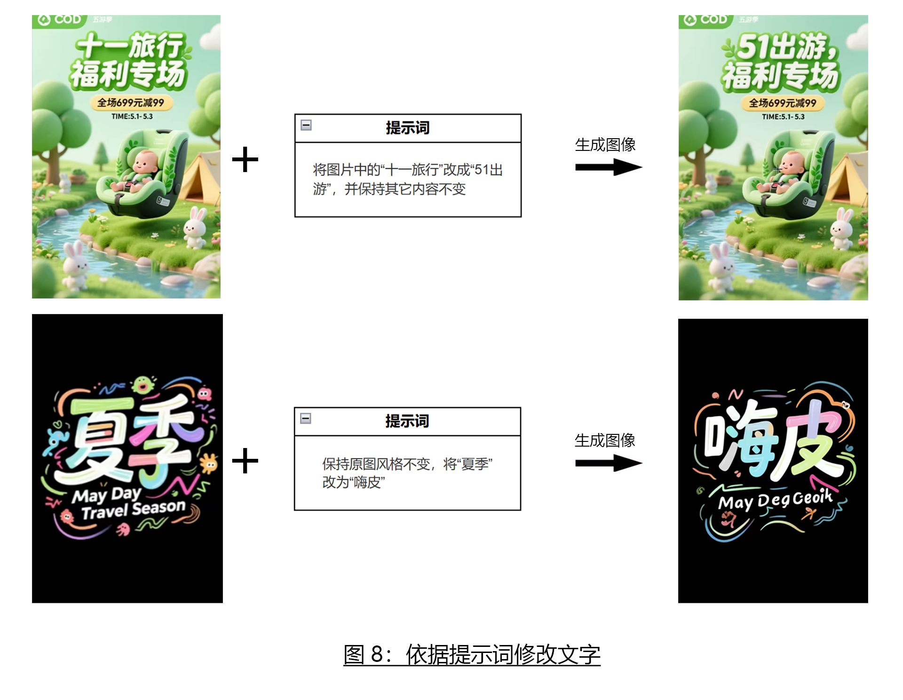 |

| 原画元素拆解 | 多风格人物一致性 |
|:---:|:---:|
| 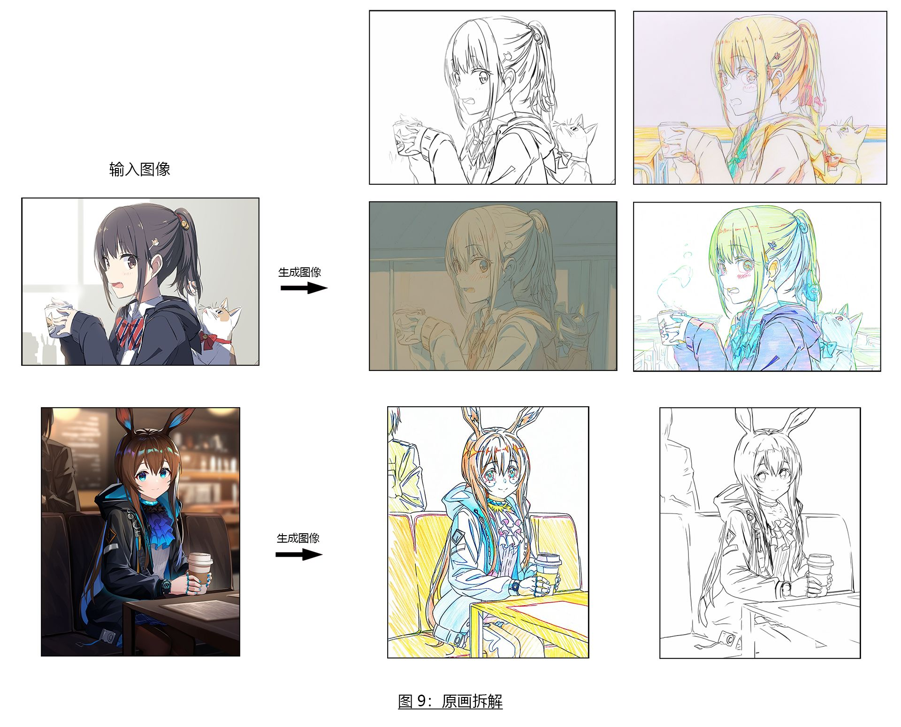 | 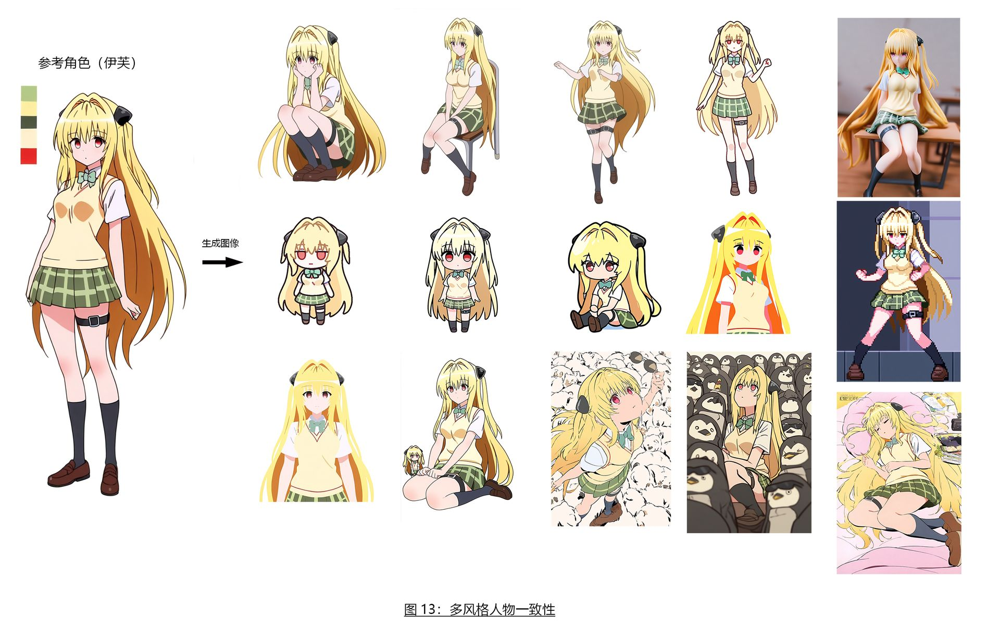 |

| 首帧动画 | 首尾帧过渡 | 首尾帧过渡 |
|:---:|:---:|:---:|
| <video src='https://github.com/user-attachments/assets/76e412e9-c330-4b24-867b-29024f0b07da' width="90%" controls></video> | <video src='https://github.com/user-attachments/assets/739e9db0-f443-46a3-8599-554d433dbcbf' width="90%" controls></video> | <video src='https://github.com/user-attachments/assets/87458ab6-1d04-4975-883b-8a8a1f782290' width="90%" controls></video> |

上述展示的所有效果都可以在个人电脑上本地实现，不需要联网，并且只需要一款软件。

------

要了解一个国家，就必须先了解其历史；要了解一个人，就必须回顾其过往经历；而一项技术的现代形态，则写在其发展的脉路中。唯有循着来时路，方能抵达理解的彼岸。

这一切，都要从2022年下半年讲起。
那时候，大多数人还没听说过“AI绘画”（ChatGPT-3.5也尚未问世），更难以想象人工智能竟能涉足艺术领域。在当时的主流认知中，AI的形象更接近一个“理科天才”——逻辑严密、运算迅猛，却与感性、创意并无关联。

真正的转折发生在2022年8月。
Stability.ai 公司发布了 Stable Diffusion 1.5 模型（如下简称为SD1.5）——并且将其彻底开源。这一举动，如同一把钥匙，打开了AI绘画的全民时代。它不仅引爆了一场技术热潮，也正式确立了现代AI图像生成工具的起点。

> 其实AI生图的技术在很早以前就出现了，只不过那时候的效果不尽人意。而早期的AI生图技术要么被大公司长久把持（闭源），要么生成图画的效果不佳，达不到破圈能力。

给不了解AI的朋友们简单解释一下什么是AI，AI的本质是数学，核心体现就是一行行的代码和算法，但更重要的是其训练得到的“知识”；这么说可能难以理解，可以把AI想象成一个大脑，一个通过代码和算法构建的虚拟大脑，但是构建好这个大脑后，你让它去画画，它啥也画不出来，为什么？你能指望一个刚出生的婴儿立马画画写字？刚构建好的这个虚拟大脑里面啥知识也没有，就如同刚出生的婴儿，这时候就需要让它学习，那它是怎么学的呢？不妨想一想我们人类画师是如何学习绘画的？那是通过长久的绘画练习，大量的临摹，日复一日，年复一年才训练出来到。而AI也类似，它也需要学习，技术人员把数以千亿的人类历史上的画作输入给这个虚拟大脑，让其自我学习，从中寻找规律，从而形成AI自己的绘画模式，这一过程依赖巨大的算力支持，远超普通个人设备的负荷。而训练数据的类型，也直接塑造了AI的“画风”。如果只给AI看油画，它自然不会生成二次元动漫——因为它从未“见过”那样的图像。

当然，所有这些的前提，是算法本身足够强大。如果模型架构先天不足，比如构建出来了一个猩猩大脑，那么你再给它学多少图像，它都学不会如何画画

因此，一个完整的“AI模型”，既包括算法结构，也包含它所学到的知识（一个虚拟大脑+它学到的知识），这一个整体叫做一个"AI大模型"。

> 目前，即便是最先进的AI，仍属于“专用型智能”，是为特定任务设计的工具，远未达到人类大脑的通用与抽象水平。

那SD1.5模型就很好理解了——它本质上是一个由Stability.ai公司设计出的“虚拟大脑”，加上从海量图像中学到的绘画知识。该公司收集了规模庞大的图片数据集用于训练这个模型，使其初步掌握了图像生成的能力。

那时的AI绘画生态还相当简单，远不如如今这般复杂。用户只需要加载一个模型、写几句正向和反向提示词（prompt），就能生成图像。不过当时开源的SD1.5模型的生成效果仍比较粗糙，画面常常扭曲或偏离预期。（当时最热门的开源工具是Stable Diffusion WebUI，它让普通人也能在本地电脑上运行AI绘画模型。）

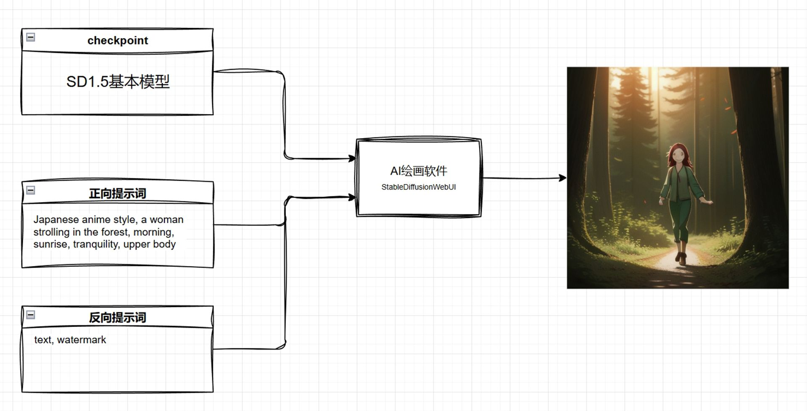

但是，因为SD1.5模型是开源的，这就意味着任何人都能对其进行一些修改，开源社区的力量被彻底释放，于是很多个创作者就拿这个SD1.5模型作为基础模型，简称基模/底模，在此基础上给这个SD1.5学新的图片。比如给SD1.5模型继续喂它个几十万张二次元动漫风格的图片，让这个SD1.5学会画动漫风格的图片，这时候SD1.5就进化了，因为它学会了画二次元图片，创作者就可以为其命名并发布，比如叫做"很会画动漫"模型，其他人就可以下载这个模型，就能在本地运行这个定制化模型。（这类模型的文件大小通常在1.9GB~5GB之间）

如下图所展示的一些AI绘画大模型（checkpoint），它们就是用SD1.5为基础模型训练出来各种风格的优秀大模型

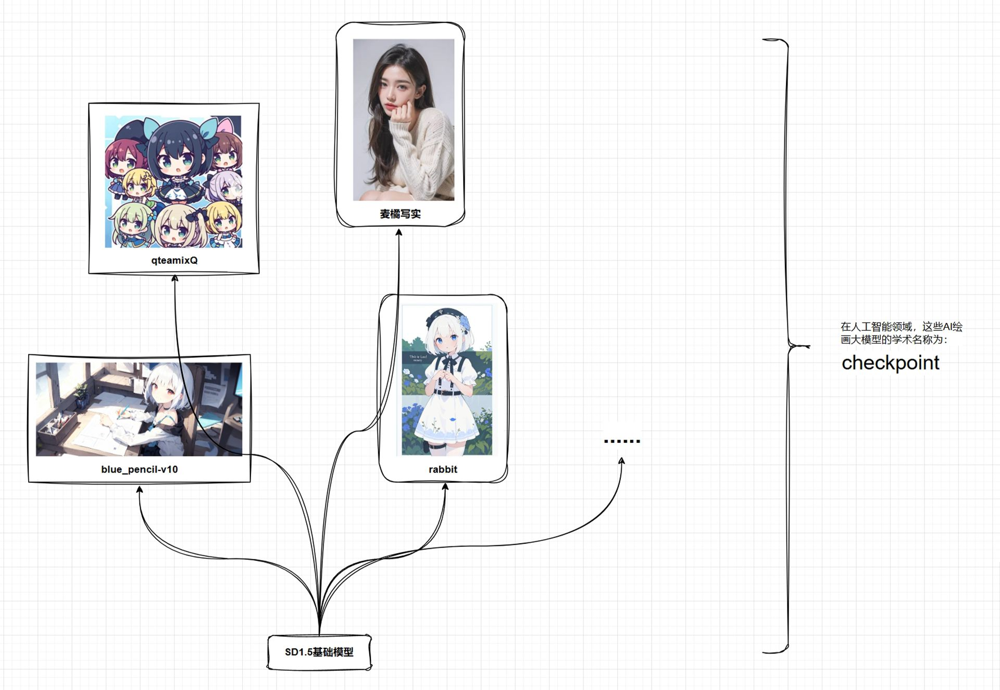

尽管基于SD1.5训练的模型效果明显优于原版，但它们仍存在一个致命问题：出图质量极不稳定，且高度依赖提示词。用户往往需要编写非常具体、甚至专业级的描述文本才能生成一张像样的图片——如下图所示，提示词长度和复杂程度都相当“恐怖”😱

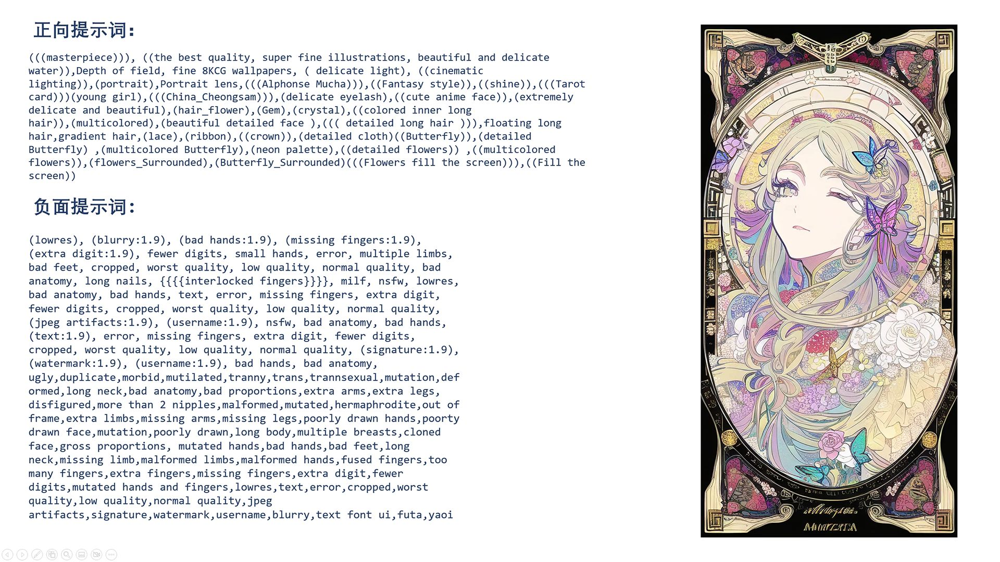

这一切都表明，早期的AI绘画是不可控的。你很难让它完全按你的意愿生成图像——也正是这种“不靠谱”，让它一度被专业绘画界视为玩具，难以真正进入商业生产流程。

直到ControlNet的出现。ControlNet这项技术真正的让AI绘画有了超高的可控性，ControlNet是以SD1.5架构基础训练出来的模型，它以插件（额外功能）的形式作用于AI绘画软件，在ControlNet模型（controlnet）和SD1.5模型（checkpoint）的共同配合来完成生图

2023年2月，斯坦福大学计算机科学在读博士张吕敏与Maneesh Agrawala共同发布了这项研究，正式提出了ControlNet结构。

什么是ControlNet？ControlNet 是一种神经网络结构，它通过添加额外的条件（如边缘检测图、深度图、姿态关键点、涂鸦等）来控制AI绘画大模型（SD1.5）的图像生成过程。简单来说，它就像给 AI 绘画加了一个“方向盘”，让你能更好地控制生成图像的内容、构图、姿态等，而不仅仅是依赖文本描述去“抽卡”，下图就是一个通过线稿控制生成结果的典型示例：

ControlNet 并不只有一个模型，而是一个系列，其中包含多种专门化模型，分别用于处理不同类型的控制任务。下图展示了几种常用ControlNet模型的基本控制效果：

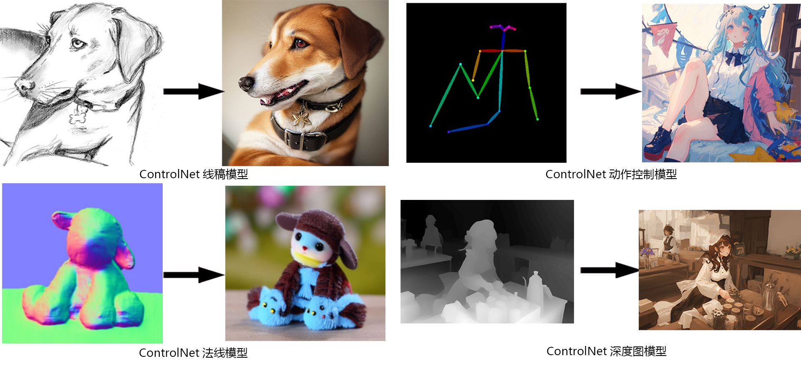

看到这里你可能会问：这些输入用的控制图又是从哪里来的？其实，它们不仅可以手动绘制，也可以借助其他AI工具自动生成。现在已经出现了不少专门用于生成控制图（如姿态识别、边缘检测、深度估算等）的AI工具，大大降低了使用门槛。

相信大家除了ControlNet，肯定还听说过一个名为T2I Adapter的技术，其实这两个本质是同一个东西。ControlNet是“开山鼻祖”， 腾讯ARC实验室也做了一个和ControlNet功能相同的东西，取名为T2I Adapter，这两个用哪个都行，都能做到如上图所示的控制。

------

上文提到，想要基于SD1.5这样的基础模型训练出一个新模型，通常需要数以万计的图片，每个模型文件（checkpoint）至少占用2G以上的空间，更不用说训练过程中对算力的巨大需求——普通计算机根本难以胜任。这给许多创作者带来了不小的门槛。比方说，如果你希望得到一个专门绘制中国水墨画风格的模型，直接去寻找现成的大模型不仅麻烦，甚至很可能根本找不到符合你需求的版本。

要是有这样一种技术就好了：只需几张图片，AI就能迅速学会某种风格，模型体积小、训练算力要求也不高——这就是我们所说的**LoRA**。

一个Lora模型非常小，但能让AI快速学会生成特定的人物、画风或物体，而不用重新训练整个巨大的模型

我们可以把像SD1.5这样的AI大模型（checkpoint）想象成一位**无所不能但风格尚未定型的“绘画大师”**：

你告诉他：“画一个女孩。” 他能画，但画出来的是随机的陌生面孔。

但现在，你想让他固定画成 **《塞尔达传说》里的塞尔达公主** 的样子。

**有两种方法：**

- **方法A（费劲的方法）：** 你把成千上万张塞尔达的图片给这位大师，让他闭关修炼几个月，从头到尾重新学习如何成为一位“塞尔达专画大师”。这非常耗时耗力，相当于重新训练一个模型（Checkpoint）。
- **方法B（巧妙的方法）：** 你不需要他重新学画画。你只给他一本薄薄的 **“塞尔达绘画指南小册子”（这就是LoRA）** 。这本小册子很小，只记录了画塞尔达的关键要点：比如她独特的金发、尖耳朵、绿色服饰等特征。大师看完后，结合他原本的全部绘画功底，就能完美地画出塞尔达了。**LoRA就是那本“小册子”。**

LoRA的用途极其广泛，几乎所有你能想到的特定对象或风格，都可以用它来定制

> **固定人物形象（最常用的功能）：** 你可以训练一个关于你自己、某个动漫角色（如雷电将军）、某个明星的LoRA。之后无论你让AI生成什么场景（在咖啡厅、在太空、变成猫娘），这个角色的脸部特征都能保持高度一致。
>
> **复刻特定画风：** 你可以训练一个LoRA来学习某位艺术家的风格（比如莫奈的印象派、吉卜力的动画风格、某个热门游戏的美术风格），之后你的所有生成图都可以带有这种风格的韵味。
>
> **生成特定物体或概念：** 比如一个特定风格的建筑、一种特殊的服装款式（如汉服）、一种抽象的装饰图案等。
>
> **控制画面细节：** 还有一些特殊的LoRA，可以用来提升画面质量、增加细节、控制色彩饱和度等。
>
> 还有很多其它意想不到的神奇功能

LoRA之所以成为AI绘画领域的重要工具，主要源于三大优势：一是因为它训练起来非常容易，只需少量图片即可完成训练；二是因为训练一个Lora模型对计算机性能要求不是很高，普通个人电脑即可完成训练。三是因为Lora模型文件占用空间很小，远小于Checkpoint，通常在几十MB到几百MB不等。

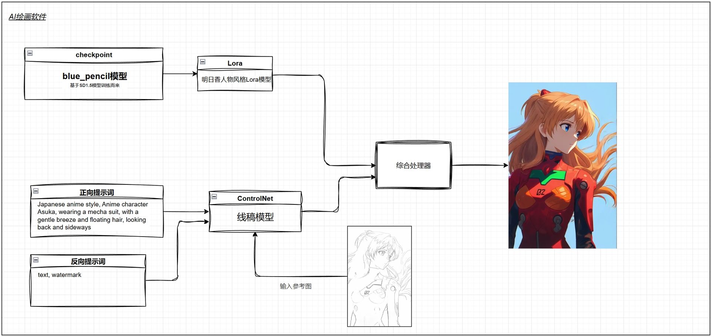

除了同期的SD1.5系列，其实还有很多优秀的基础模型，比如Midjourney公司的绘画模型，OpenAI公司的DALL-E 3模型等，即使那时候Midjourney之类的模型出图效果确实要好于SD1.5系列模型，与它们相比，SD1.5虽然在生成效果上未必占上风，却凭借其独特的开放性赢得了大量开发者和创作者的青睐。Midjourney等模型尽管表现优秀，但属于闭源商业产品，用户只能通过官方渠道付费使用，缺乏社区参与和二次开发的空间。相比之下，SD1.5不仅完全开源，还带动了全球范围内的技术共享与创新。

当时，国内也逐渐涌现出许多基于AI绘画的小程序和在线平台，其中绝大多数都是以SD1.5为基础进行微调，还没有完全自主研发的底层AI绘图模型。

SD1.5之所以与众不同，关键在于两方面：一是其较低的硬件门槛。即便是一张普通的英伟达消费级显卡，也能较好地支持SD1.5的训练和推理。模型参数量相对较小，使得普通人也有机会在个人电脑上运行和实验。另一方面，也是更核心的一点——开源。开放的模式吸引了大量开发者共同参与生态建设，不断推出新的插件、工具和预训练模型，形成了活跃的技术社区。

除了之前提到的LoRA和ControlNet等关键技术，SD1.5生态中还包含众多其它重要组件与技术概念。理解这些内容，将有助于你更全面地掌握SD1.5的工作原理（请保持耐心，一旦掌握SD1.5的生态，后续诸如SDXL、Flux、Wan2.x、Qwen-Image等模型也都将迎刃而解，实现“一通百通”）。

------

首先，什么是VAE？如果你玩过AI绘画，大概率见过这个词——经常用它，却未必清楚它到底做了什么，也不知道为什么会有那么多不同的VAE模型。

要理解VAE，我们得先从一个实际问题说起。

一张图片，放大再放大，本质上是由无数像素点构成的。就拿一张1024×1024的普通彩色图像来说，它拥有RGB三个颜色通道，实际上的数据量是 1024 × 1024 × 3 = 3,145,728 个像素点。在计算机中，每个像素往往用浮点数保存，这就导致一张图片所占的内存非常大，直接处理它，计算慢、显存占用极高，几乎难以实现实时生成。

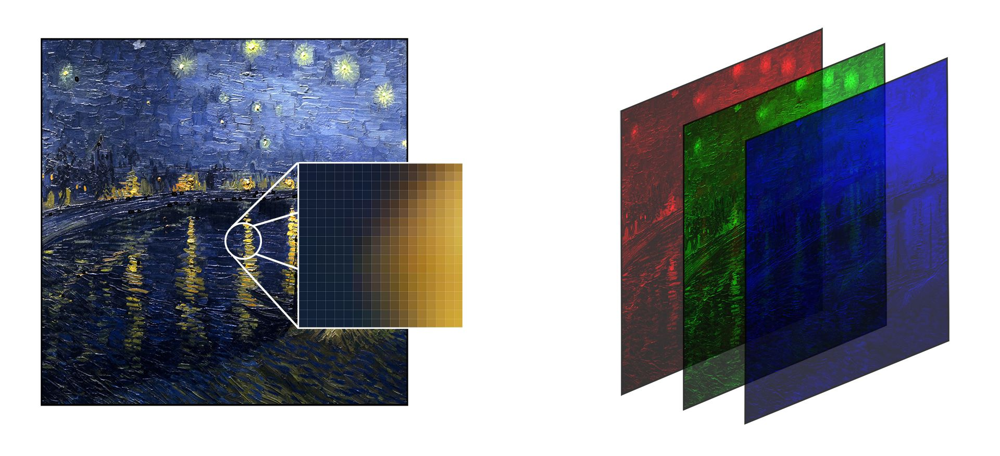

这不仅是AI绘画的痛点，更是整个视觉AI领域长期以来的基础难题。而VAE（Variational Autoencoder，变分自编码器）的出现，正是为了解决这个问题。

你可以把VAE理解为一种专为图像设计的“智能压缩-解压算法”。它本身也是一个神经网络，作用是在尽量不丢失视觉信息的前提下，把高分辨率图片压缩到一个极小尺寸的表示形式，我们一般称这个压缩后的东西为潜空间（Latent），同时vae也可以将压缩后的东西“解压缩”还原为原始图片，这就是vae的全部功能。

这才是AI绘画真正的工作方式：模型（如 SD1.5）并不是直接“画”出一张几百万像素的完整图片，而是先在潜空间中生成一个轻量版的图像表示（通常比原图小64倍），然后再交由VAE“解压缩”还原成最终我们看到的清晰大图。

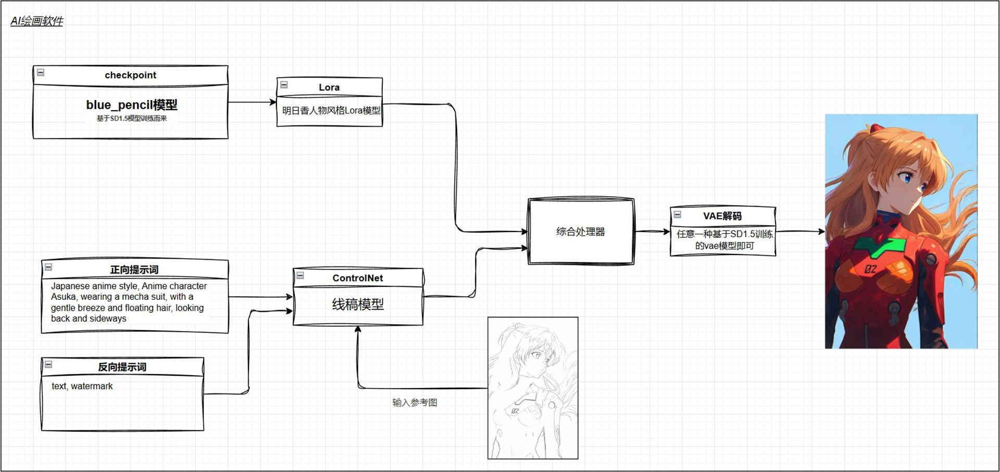

正因为有了VAE，AI绘画才变得高效可行。而不同VAE模型的存在，也意味着不同的“压缩-解压”风格——有的色彩还原更鲜艳，有的细节保留更扎实，这就为我们优化图像输出效果提供了另一种微调手段。

------

VAE部分就介绍到这里，接下来我们聊聊Embedding和CLIP——这两个也是AI绘画的常客的

当我们使用AI生成图像时，一个必不可少的环节就是编写“提示词”。可是AI是怎么读懂我们输入的提示词的呢？AI可听不懂英语和中文。这时候，CLIP就派上用场了。你可以把它想象成一位“AI翻译官”，负责将人类语言（如中文或英文）转换成AI所能理解的数值表示——也就是高维向量（就是一大堆数字）。

我们知道，很多中文词汇是无法翻译为英语的，比如“孤舟蓑笠翁，独钓寒江雪”就很难原味的翻译为英文，英文无法表达这种文化语境。同样的，对于AI来说，人类自然语言所能传达的信息其实非常有限，而AI所能理解的语义空间却广阔得多。换句话说，自然语言在AI眼中是一种“信息压缩格式”，很多AI内部的视觉概念根本无法用人类词汇精确描述。因此，仅靠文字提示词翻译成的AI语言往往只能为AI提供一个大致的创作方向，难以实现精细控制。

CLIP负责把文字转换为AI语言，而另一类技术（不在此处过多介绍）则可将一张图片翻译为AI可读的数值形式，而一张图像所包含的信息量，往往远超一段文字描述。如果我们把某一类“不好看”的图像（比如结构扭曲、色彩失调）批量编码成AI可读的格式，并保存为一个模型文件，例如命名为`bad_prompt.pt`，那么在进行AI绘画时，就可以将它作为“负面提示词”输入给AI，从而避免生成类似风格的图像。诸如`bad_prompt.pt`这类文件，就是所谓的Embedding模型。

> 需要注意的是，目前Embedding模型的使用频率已经大幅下降，哪怕是负面提示词也较少采用这类模型。原因在于现阶段的AI绘画模型本身已经足够强大，学会了更通用的表示与排除机制——我们将在后文讨论这一点。

------

相信你读到这里肯定会不耐烦的吐槽，“为什么一个小小的AI绘画会有这么多东西”，不得不说，当前的AI绘画技术确实正朝着高度专业化的方向演进，需要掌握的前置知识不仅多，而且前后衔接紧密。到目前为止所介绍的内容，基本还都属于2023年的技术体系。但不论怎么说，只要你扎实掌握SD1.5的生态与绘图逻辑，即使面对最新、最前沿的AI绘画技术，也能够快速上手。

接下来，我们继续聚焦SD1.5生态系统中的一项实用功能——**局部重绘（Inpaint）**。

什么是局部重绘？简单来说，就是当你生成了一张整体氛围很棒、但某个细节却不尽人意的图像时，通过划定区域指示AI重新绘制该部分，其余区域则保持不变。例如下图所示：

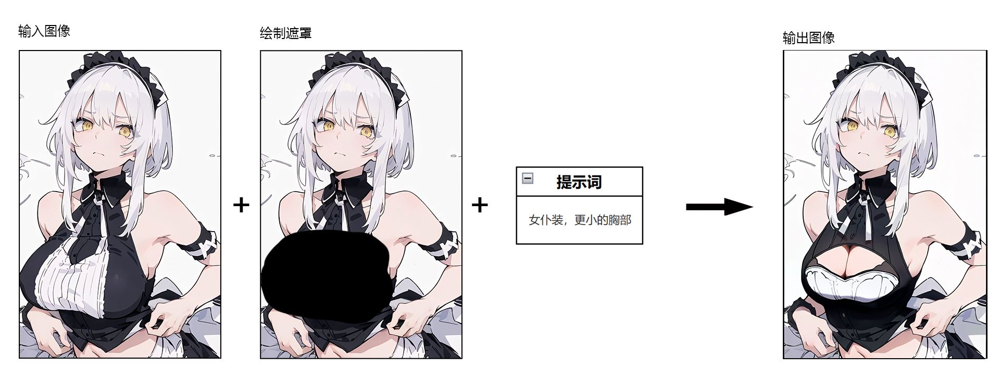

AI既然能生成整张图像，仅修改局部自然不在话下。局部重绘可以说是一项非常重要的基础技术，无论是给照片中的人物**换装，换脸，换背景**，还是从照片中**抹去某个不需要的物体或人物**，都需要局部重绘技术作为基底

目前实现局部重绘的方式有多种，各有优劣。（主流方案包括ControlNet中的inpaint专用模型，以及ComfyUI生态系统中的comfyui-inpaint-nodes，BrushNet插件等）。

------

除了局部重绘，还有一个值得特别关注的技术——IPAdapter。简单来说，它是一种“风格迁移”工具，允许用户额外输入一张参考图像，AI 在生成新图像时，会借鉴这张图片的风格与内容元素，从而生成视觉上连贯、风格接近的作品。

举个例子，当你在网络上偶然看到一张风格独特、非常符合你审美的插画，你想让你的AI也能绘制这种风格的图片，但是由于它的绘画风格过于个性化，找不到现成的这种风格的大模型或者Lora，此时你只需要将心仪的图片作为参考输入，AI 就能在此基础上生成类似风格的图像，大大降低了风格化创作的门槛。

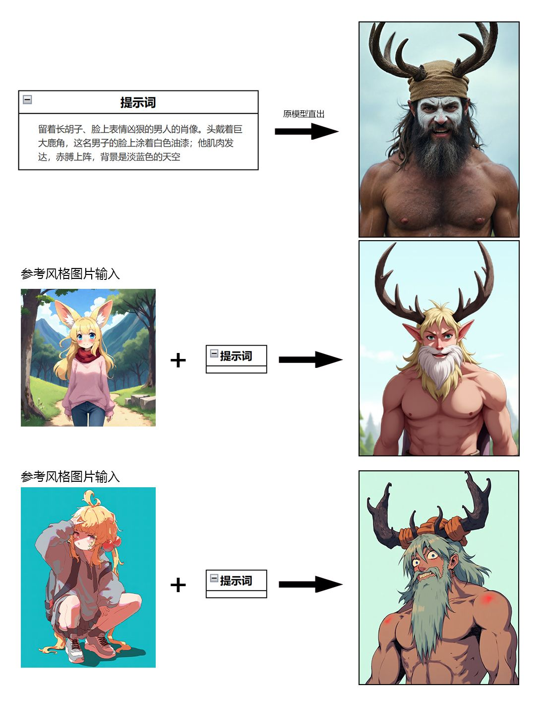

讲完这些辅助技术，现在我们来深入聊聊 AI 绘画的核心：AI 到底是如何“画”出一张图的？在理解这一点之前，不妨先回忆一下人类画师是如何创作的：他们通常从构图思路出发，一步步打草稿、定轮廓、铺色、细化，整个过程逻辑清晰、步骤严密。但 AI 的创作方式完全不同——它使用的不是纸和笔，而是“噪声”“概率”和“潜空间”。

人类画师起步是一张白纸；而 AI 起步，是一张布满随机噪声的图像。AI 绘画的本质，就是一个不断去除噪声、逐渐显现结构的过程，它不是在“绘制”，而是在“演化”。

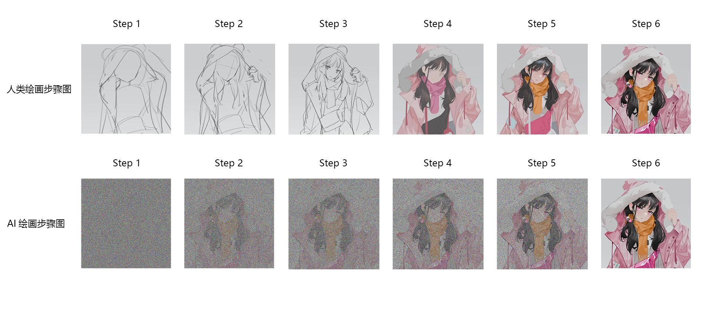

至今为止，我们所见到的所有 AI 绘画乃至 AI 视频，底层都依赖于一项根本技术——Diffusion（扩散）算法。其具体原理复杂，不在此阐述，但基本步骤正如上图所示：AI 从完全杂乱无章的状态开始，逐步推演出一个有意义的画面。

回顾一下AI是如何学会“绘画”的？它是通过海量数据训练而来的——数以亿计的图像被输入进模型，它从中学习像素之间的统计规律和视觉模式，也仅此而已了。AI 并不“懂”它在画什么：它不了解物理法则，不能真正理解文字，更不具备审美意识或创作意图。它只是基于所学到的概率分布，**计算**出最可能符合输入描述的图像结果。

也正因如此，AI 所生成的图像往往是“弱逻辑”的——它擅长风格、质感甚至组合创新，但在需要严格逻辑支撑的图像生成（如设计图纸、解剖示意图、工程制图等）方面表现非常差。现在依然如此（并且这与训练集大小无关）。

以上便是关于Stability Diffusion 1.5（SD1.5）的简要介绍，相信你已经对其生态系统有了一个整体性的认识。需要注意的是，本文是从宏观视角梳理SD1.5的发展脉络与技术背景，更多细节和深入的技术内容，还需要在具体使用和进一步学习中掌握——不过有了这些前置知识的铺垫，后续的学习将会事半功倍。

现在，让我们把目光重新聚焦于Stability.ai这家公司。自2022年8月开源SD1.5以来，它并没有停止迭代的步伐，反而持续推出了多个升级版本的模型，且始终坚持开源共享的策略。

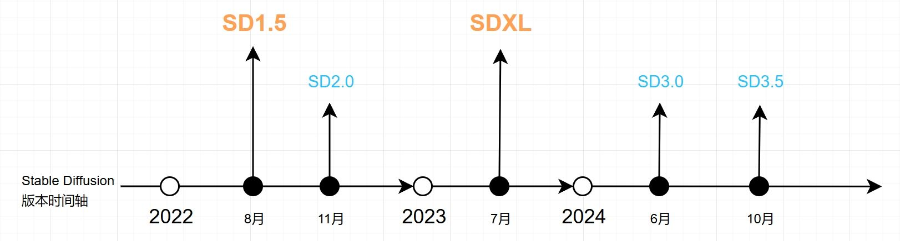

从上方时间轴可以看出，在SD1.5之后，Stability.ai公司陆续发布了多个模型，然而，这些模型在社区中并未引起太大反响，使用率也相对有限。客观来说，Stability.ai公司在SD1.5之后的几次尝试，从传播效果和应用规模上来看，并不算成功。然而除了Stable Diffusion XL（以下简称为SDXL），SDXL是Stability.ai公司继SD1.5后的一个新的顶点。

可以说，SDXL才是SD1.5真正的“继承者”，它不仅延续了前代开源、开放的精神，更在生成质量和视觉表现上实现了质的飞跃。经过几年的生态积累与不断打磨，SDXL已然成为当前主流的专业AI绘画工具之一，其综合能力远优于SD1.5，也正在逐步取代后者，成为创作者和行业应用的新标准。而SD1.5生态正在慢慢的退出人们的视野。

SDXL 与 SD1.5 在模型架构上存在根本差异，这也导致了一个现实问题：SD1.5 生态中广受欢迎的诸多工具（如 ControlNet、LoRA、IP-Adapter 等）并不能直接应用于 SDXL。正因如此，SDXL 在发布初期只能完成基本的文生图功能，缺乏更高级的控制与扩展能力——这也解释了为什么它刚推出时在社区中反响较为有限，用户接受度并不高。

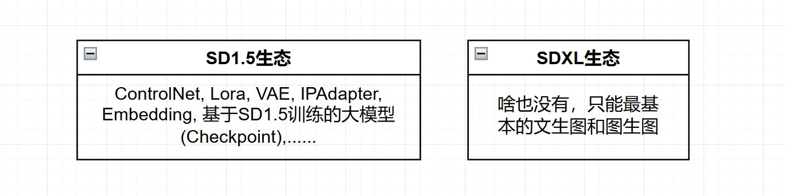

然而，随着开源社区持续不断的努力，原本在 SD1.5 中被验证极为有效的各类技术，逐渐被移植和适配到 SDXL 中。几年发展下来，如今的 SDXL 生态已经非常成熟和完善：不仅覆盖了 SD1.5 所能实现的一切，更扩展出许多新的技术可能性。

从组件类型来看，SDXL 生态与 SD1.5 大致相仿，包括 ControlNet、LoRA、Embedding、IP-Adapter、VAE 和 checkpoint 等核心模块均得以保留和延续。接下来我们将讲解 SDXL 与 SD1.5 的几个关键不同之处。

首先是硬件配置要求。如果只想在本地运行 SD1.5 进行绘图，显卡显存只需 4GB 或以上即可基本满足需求；但如果想要流畅使用 SDXL，对显存和计算能力的要求就显著提高。而若希望基于 SDXL 训练新的大模型（checkpoint），硬件门槛更是水涨船高。

此外，Stability.ai 官方为 SDXL 配套推出了一个 Refiner 模型，宣称配合使用可进一步提升生成图像的质量。但实际应用中，很多用户反馈 Refiner 的效果并不明显，甚至有时几乎感知不到其作用。大家可以忽略它的存在。

> （题外话：如果你对动漫、二次元或平面插画内容不感兴趣，可以跳过本章节，直接阅读后续部分。）
>
> 众所周知，现今在动漫与平面插画生成领域表现最出色的模型，是来自NovelAI的V3模型（以下简称nai3）。NovelAI是一家专注于AI叙事与图像生成的国外企业，尤其以动漫风格生成技术闻名。nai3可说是当前动漫类AI模型的集大成者——它所生成的图像不仅几乎看不出“AI味”，还自带一种独特且优美的质感，风格多样、细节丰富。甚至可以说，它的“画技”已经超越了大部分人类画师，也因此被许多动画工作室纳入生产流程。
>
> 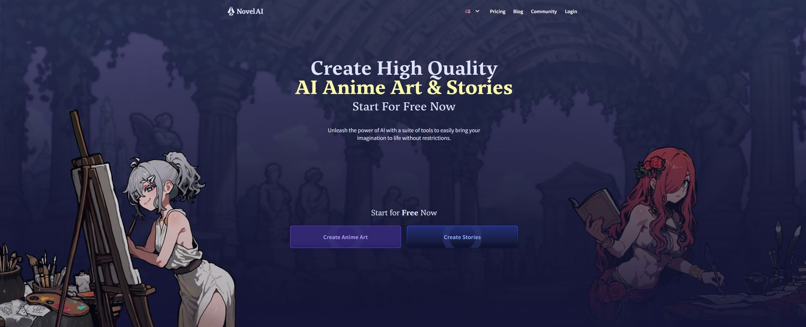
>
> 
>
> 不过，nai3是一个闭源的商业模型，不在SD开源体系中。用户无法将其下载到自己电脑里面运行，只能去他们的官网付费使用。
>
> 那么，是否存在效果出众、完全开源、支持本地部署的动漫风格模型？有的兄弟，有的。如今站在开源动漫生成顶端的，便是 illustrious-XL 系列（中文称作“光辉”系列）。像大家耳熟能详的 NoobAI-XL、WAI动漫模型，都属于这一系列。更令人兴奋的是，“光辉”系列完全基于SDXL生态构建——也就是说，只要你掌握了SDXL的基本使用，就能直接调用这些当前最顶尖的开源动漫模型。它们本质上就是SDXL生态系统中的 checkpoint 组件。
>
> 对于还不了解光辉系列的同学，这里简单介绍一下：illustrious 是由韩国 Onoma AI Research 团队基于 SDXL 架构训练的专业动漫绘画模型，使用了高质量的 Danbooru 标签数据集进行训练。该项目的领导人是宋敏（Song Min），他也是 Onoma AI 公司的 CEO。该模型的论文于 2024 年 9 月 30 日正式发表，而实际上 v0.1 版本早在 9 月 25 日就已率先在开源平台 Civitai（C站）发布。
>
> 截至 2025 年 3 月 18 日，光辉模型已经迭代到 v2.0 版本。这一代模型使用了超过 2000 万张动漫图像进行训练，涵盖了截至 2024 年 8 月的各类动漫、游戏角色形象，以及此前众多知名画师的风格。这意味着，你只需通过提示词指定某个人物或画风，光辉 2.0 几乎都能高质量地还原出来。而 NoobAI-XL 则是在光辉的基础上做了进一步优化，表现更为出色。
>
> 值得一提的是，光辉系列虽然基于 SDXL，但其架构和训练方法具有一定的特殊性，使它不同于常规的 SDXL 派生模型，甚至可以说自成一派。这也带来一个技术细节：SDXL 生态中常用的 LoRA、ControlNet 等控制组件并不能直接用于光辉系列，必须是专门为光辉系列设计的Lora和ControlNet才行。不过目前光辉自身的生态系统已经比较成熟，不在此处过多介绍了。
>
> 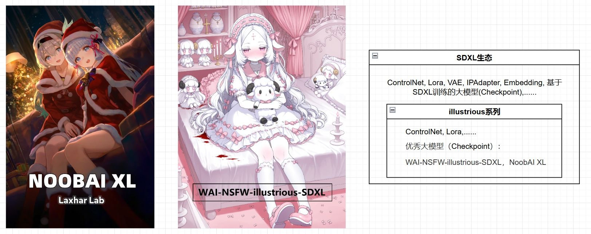
>
> 不过想要完全驾驭光辉系列模型还是有点难度的，你需要仔细阅读其官方手册和高阶专业提示词写法。
>
> 如果你学习 AI 绘画的主要目标是生成动漫类图像，那么掌握 SDXL 生态加上 Wan2.x 这样的视频模型已经完全足够。至于其他诸如 Flux、Qwen-Image 等架构，它们对设备要求极高，且在动漫生成领域的效果远不如光辉系列那么出色——它们更侧重于真实系图像的生成，非专攻动漫插画方向的朋友可以暂不深入。

相信不少朋友都有过这样的疑问：明明SD3.0和SD3.5是在SDXL之后推出的，按理说性能应该更强大，可为什么当前主流使用的仍然是SDXL，而非更新的SD3系列？这背后其实隐藏着一个关于**技术路线、开源理念、公司战略以及团队变动**的多层故事。

首先，Stability AI陷入了严重的财务危机，公司亏损数千万美元，资金链的压力直接影响了其技术推广和新模型的生态建设。

其次就是SD3系列的许可协议争议，简而言之就是他们想搞“半闭源”，这引起全球最大的Stable Diffusion资源库之一CivitAI宣布暂时禁止所有与SD3相关的资源，公众对SD3系列的信任破裂。信任一旦破裂，社区的推力也随之消失。

正是由于Stability AI内部的财务困境、管理问题以及可能的技术路线分歧，以Robin Rombach为首的原Stable Diffusion核心团队选择集体离职，领导层的真空和核心人才的流失，严重影响了公司的稳定性和研发进度。

Stable Diffusion核心团队离职后，他们迅速创立了Black Forest Labs（黑森林工作室），这家新公司获得了3200万美元的种子轮融资，并致力于推进生成式深度学习模型的发展，2024年8月，Black Forest Labs推出了他们的首个产品：**FLUX.1系列模型**。它在图像细节、提示词遵循能力、风格多样性和复杂场景生成方面表现出色，被认为在性能上超越了Midjourney、DALL-E 3以及Stable Diffusion 3系列。

从某种意义来说，**FLUX才是接续SD1.5、SDXL精神的“正统进化”**。更重要的是，它依然坚持开源。随着社区陆续推出基于FLUX的ControlNet、LoRA、超分模型和IPAdapter等，一个围绕FLUX的新生态正在缓慢但坚定地形成。

不过，即便FLUX被公认为当前综合能力最强的生成模型，它仍有一个绕不开的短板——极高的硬件门槛。
单个FLUX模型就占用16GB存储空间，而想要舒服的生成图像，建议显存不低于16GB，这意味着你需要一张RTX 4080、4090或新一代的5070Ti、5080、5090等高端显卡。这还只是“使用”的门槛，如果要在此基础上训练新的checkpoint或LoRA，则只有专业工作室才能承担得起这样的算力成本。

正因如此，FLUX目前的生态丰富度远不如SDXL，发展速度也相对缓慢。它展现出了技术的天花板，却也暴露了AI平民化之路依然漫长的现实。

如果你打算深入探索Flux生态，以下几个关键技术值得你在学习过程中重点关注——它们不仅是Flux体系的核心组成部分，也直接影响到实际应用的体验与效果。

> **1. Flux局部重绘与扩展：flux1-fill-dev**
> 与SD1.5和SDXL使用通用模型处理重绘与外扩（inpainting/outpainting）不同，黑森林工作室专门为这一任务训练了一个独立大模型：**flux1-fill-dev**。该模型体积约为16GB，在细节连贯性和空间合理性方面表现更为精准。
>
> **2. 风格迁移工具：Redux**
> 虽然Flux生态中已有IPAdapter可实现风格参考，但官方还推出了更专业的风格迁移模型——**Redux**。它在商业级图像生成中表现优异，尤其适合电商场景，例如模特换装、产品精修、高质感静物图等。不过，Redux的操作门槛较高，需一定的调试经验才能发挥其真正实力。
>
> flux1-fill-dev 与 Redux 被合称为 **Flux Tools**，可视为Flux面向专业应用的“增强套件”。
>
> **3. 提升真实感：Flux Krea Dev**
> 针对社区反馈“Flux出图‘AI味’太重”的问题，黑森林工作室进一步推出了**Flux Krea Dev**（同样约16GB）。该模型在光影、材质和构图的自然度上有显著提升，生成结果更接近真实摄影，实用性大幅增强。
>
> 
>
> **4. 万物迁移技术：ACE++**
> 这是阿里通义实验室基于Flux架构开源的一组LoRA模型，中文常称作“**万物迁移**”。它包括三个功能模块：
>
> 人物肖像迁移，区域增删物体，物体特征替换
>
> ACE++ 极大扩展了Flux在内容编辑方面的灵活性与控制精度。
>
> 
>
>  **5. 智能修图：Flux Kontext Dev**
> 这是一个功能导向的指令响应模型。你可以将它理解为“能听懂人话的修图师”——只需用自然语言描述修改需求，例如“去掉水印”“调整色调为暖色”“把天空换成夜晚”，它就能智能地识别图像区域并执行相应编辑。其应用场景非常广泛，从简单的去水印到复杂的多对象替换均可实现。

我知道大家肯定还想知道国内的一些AI绘画技术的历史发展，但不得不承认，相较于国外成熟的开源生态，国内的AI绘画应用在很长一段时间内处于“用户体验优先、技术开放滞后”的状态。许多面向普通用户的国内AI绘画平台，绘画网站和小程序，确实存在体验局限：它们往往以“免费试用几次”作为引流策略，但生成效果参差不齐、可控性较弱，甚至很多底层模型仍是基于Stable Diffusion微调或间接使用，却在操作流程和功能层面做了大量简化与封闭处理。更令人不解的是，一些模型分享社区居然也对下载和访问设置付费门槛——这与Hugging Face、CivitAI等国际平台坚持的开放共享精神背道而驰。

因此，如果读者是希望在创作或生产环境中真正使用AI绘画，我依然更推荐此前介绍过的Stable Diffusion、Flux等开源体系。它们不仅在模型性能、可控性、插件生态上更为成熟，更重要的是——它们免费、自由，并且被全球开发者持续迭代。

*（2025.12补充：最近这段时间，闭源商业AI绘画产品的发展势头越来越猛。像视频生成领域的Sora2、Vidu Q2，以及图片编辑类的nano banana pro等模型，不仅在效果上大幅提升，操作也愈发简单直观，它们大多融合了当前强大的语言模型，用户只需输入几句话、调整几个设置，就能快速生成高度符合需求的图像或视频，效率提升非常显著。即使这些模型未来开源了，它们巨大的参数量也决定了很难在消费级显卡上流畅运行——换句话说，我们依然绕不开“付费使用”的现实。说实话，作为一个长期关注AI绘画领域的博主，我也开始感到一丝迷茫。目前以ComfyUI为代表的开源方案，虽然灵活且可控，但更多局限于相对简单的任务。对于高级的图像编辑、视频生成等复杂需求，想在本地设备上实现几乎不太可能。这种能力上的差距，不禁让我对开源路线未来的竞争力，产生了一些不确定感。）*

不过，我们也不能一概而论。尽管消费级应用表现参差，近两年来，国内科研团队和企业也在积极推进具有竞争力的**开源模型**。

例如，**阿里巴巴通义千问团队发布的Qwen-VL（Qwen-Image）系列模型**，不仅支持高质量的图像生成，更在视觉-语言联合理解与推理上表现突出，展现出强大的跨模态能力。它完全开源，可免费商用，极大地降低了技术使用的门槛。

而真正让人惊艳的是**阿里云通义万象团队推出的Wan（万）系列视频生成模型**。它以视频生成为主，这一模型开源发布后，迅速成为国际学术界和开发者社区关注的热点。

可以说，国内的AI绘画技术正在两条路上并行：一条是面向大众的、轻度但商业化的产品路径；另一条则是真正回归技术本质、坚持开源共享的科研与工程之路。而后者，才真正代表中国AI的未来，代表了中国AI的硬核实力与开放胸怀。

*（2025.12补充：最近看到阿里巴巴开源的一款绘画模型——Z-image，确实令人眼前一亮。它的模型体积控制得非常小，参数规模也相对精简，但实际生成效果却相当出色，甚至能与Flux2这样的主流模型媲美，而且还支持文字生成功能。反观Flux2，虽然性能不俗，但在模型体量上显得有些“臃肿”。Z-image的出现，让我重新看到了希望：或许在不久的将来，我们真的能够实现“小而美”的AI模型——不仅效果不打折，还能更轻量、更易用、更亲民。）*

------

接下来为大家简单介绍一下Qwen-Image 和 Wan 

首先，**Qwen-Image** 是由阿里巴巴通义千问团队推出的首个图像生成基础模型。可以把它理解为“中国版的Flux”——它在整体架构和性能特点上与Flux较为接近，优缺点和Flux差不多,但也具备一些独特的优势，它支持中文提示词输入，不再是将中文翻译为英语输入给模型了，这意味着模型本身具备中文语义理解能力，生成过程更贴合中文语境。其次，就是其强大的文字控制能力，Qwen-image生成的图像中的文字都极其清晰、准确，你可以用它生成各种艺术字，本文最开始的图7和图8就是由Qwen-image所绘制，它不仅支持绘制中文字，英文和数字也支持；在推出Qwen-Image后的一段时间后，通义千问团队又发布了一款名为Qwen-image-edit的模型，可视为国内首个类似“Flux kontext”的图像编辑模型，唯一的不同依然是其强大的文字绘制能力

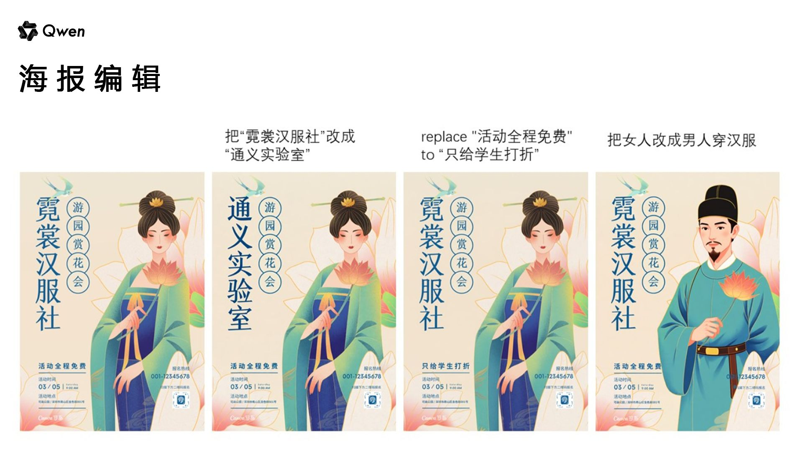

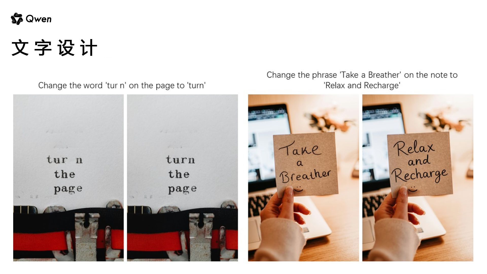

不过需要注意的是，Qwen-Image 作为较新推出的模型，其生态系统还在逐步完善中，加之对计算资源的要求较高，因此目前若非对文字准确性有特别需求，一般仍建议优先选择生态更成熟、支持更广泛的 SDXL 或 Flux 系列。

接下来介绍一下 Wan 视频模型。严格来说，AI视频生成已经跨入另一个技术赛道，不同于AI绘画的静态生成逻辑，因此我不会在这里展开讲太多细节，只说几点我认为有趣的内容。

在 Wan 出现之前，市场上已经涌现出不少视频生成模型，但它们往往在连贯性、清晰度或语义还原度方面存在局限。Wan 的推出和完全开源，正是在这一背景下的重要突破，因其出色的综合生成能力，不少企业与工作室已经将其作为基础模型进行二次开发和使用。Wan系列目前有两个模型，Wan2.1和Wan2.2，它们都非常擅长写实风格的视频生成，但是在动漫二次元领域，其生成效果就不是那么好了，我通过大量测试发现，发现Wan2.2非常适合绘制3D动画，而在绘制平面2D动漫的时候会倾向于生成live2d，骨骼动画那种类型，并非我们通常所见日本番剧那样的动画风格

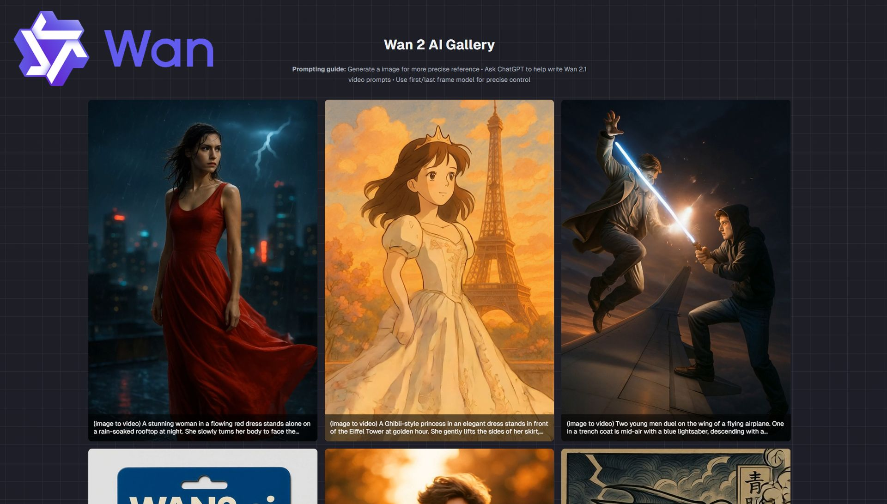

如果你曾关注过AI动漫视频方面的内容，可能听说过Bilibili自研的Index-anisora动漫视频模型，这是一款专门针对动漫类的视频生成模型，可以实现首尾帧动画，动态漫画，图生视频，骨骼动画等诸多内容，但是其第一版的效果并不是很好，也没在社区引起多大的反响，后来团队基于Wan模型、结合B站庞大的二次元数据进行训练，推出的v3.1版本效果提升显著，明显好于初版的，但它对我们普通玩家有一个致命的缺点，就是要极高的电脑配置，5090来了都运行不了这个动画模型，除非是超大显存的专业计算卡。

<video src='https://github.com/user-attachments/assets/06743d3e-4a46-4185-954f-3bc9be80421e' 
       controls 
       style="
           border-radius: 8px;
           border: 2px solid #ddd;
           max-width: 88%;
           background: #000;
       ">
</video>

显然我们大多数人肯定是无法体验到Index-anisora了，但是有一款视频模型额外引起了我的注意，那就是AniWan2.1模型，它由日本的hakoniwa基于Wan2.1训练而成，是一个专门绘制动漫视频的模型，与Index-anisora相比，它的模型体积和配置要求友好得多，和FLUX模型相近，但生成效果却相当出众，在我看来甚至不输Index-anisora太多，事实上，本文中展示的所有动漫视频，都出自AniWan2.1。

| Video 1 | Video 2 |
|:---:|:---:|
| <video src='https://github.com/user-attachments/assets/cfafa952-840a-4529-ad0e-0d715bb12587' controls style="border-radius: 8px; max-width: 95%; box-shadow: 0 4px 12px rgba(0,0,0,0.15); background: #000;"></video> | <video src='https://github.com/user-attachments/assets/d44bf816-bf6c-4f3b-971c-1cc53a37654f' controls style="border-radius: 8px; max-width: 95%; box-shadow: 0 4px 12px rgba(0,0,0,0.15); background: #000;"></video> |
| **Video 3** | **Video 4** |
| <video src='https://github.com/user-attachments/assets/e984b9f4-b7f3-48e9-b232-ae12d0100b87' controls style="border-radius: 8px; max-width: 95%; box-shadow: 0 4px 12px rgba(0,0,0,0.15); background: #000;"></video> | <video src='https://github.com/user-attachments/assets/e4b4cc8d-2ec2-487c-9bf2-433f243c5b6e' controls style="border-radius: 8px; max-width: 95%; box-shadow: 0 4px 12px rgba(0,0,0,0.15); background: #000;"></video> |

以上就是自2022年以来AI绘画发展的主要脉络。除了以上提到的模型与体系，其实还有许多值得一提的项目——例如OpenAI的Sora、HiDream、Cosmos、OmniGen、腾讯混元Hunyuan、ToonComposer、KLing等。但它们或因完全闭源、效果未达第一梯队，或因生态开放程度有限，我并没有逐一展开。毕竟，本文的关注点始终聚焦在那些真正推动行业开放与创新的力量上。

讲到这里，可能很多读者会产生一个实际的问题：这么多模型，到底该如何上手使用？

若想顺畅地在本地运行上述AI绘画模型，你的电脑需要满足两个基本条件：一是Windows操作系统（Linux也可以），二是拥有一块性能足够的英伟达显卡——没错，显存越大，体验越丝滑。

而软件方面，目前主流的选择有三：SD-WebUI、SD-Forge，以及ComfyUI。很多人会推荐新手从SD-WebUI开始，它确实对初学者更友好。但既然你已经读完本文，对AI绘画的整体体系有了基本认知，我反而更建议你直接尝试ComfyUI。

ComfyUI不仅是一个工具，更是一个高度可定制、兼容极广的“模型容器”——世界上绝大多数开源绘画模型都能在此运行，本文中所有示例图像和视频都是在ComfyUI中绘制。我知道，很多人第一次打开ComfyUI，都会被它那个布满节点、仿佛电路图般的“工作流”界面吓到。但请别担心，你可以把它理解为一种“编程版的连连看”，视觉复杂，却逻辑清晰。更重要的是，你并不需要一开始就搭建复杂流程——很多高级节点组，其实根本非必需。

至于如何获取ComfyUI？我明白，很多对AI绘画感兴趣的朋友并非技术背景，自行从GitHub构建工程确实门槛较高。这里我强烈推荐B站UP主“秋葉aaaki”制作的整合包，解压即用、一键启动，对非开发者非常友好，也极大降低了入门成本。

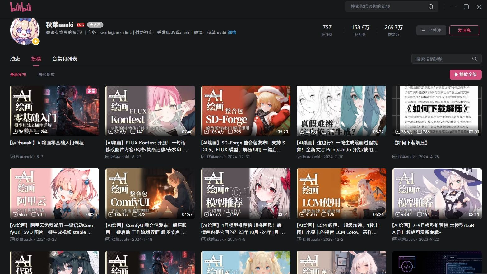

以后，当你在网上冲浪时，如果发现一个特别惊艳的AI绘制的图，你首先要问的不是“这是用哪个软件画的？”，“这用的是什么模型？”，而是要问“这是属于哪个生态的，是SD1.5，SDXL，还是Flux等等”，要学就挑准一个生态好好学，不要一下子学SDXL，一下子又跳回Flux

------

读到这里，你是不是迫不及待的想立马去学习AI绘画了，但是我想说，先别急，在冲动之前，不妨先冷静下来问自己一句：我真的需要深入学习AI绘画吗？

以我自己的体验来说，学习AI绘画远不止“提示词+生成”那么简单。它是一个极其消耗时间、耐心与硬件资源的过程。大多数时候，你并不是在创作，而是在反复下载模型、调试组件、兼容版本、调参试错。学习曲线陡峭，且学成之后，若没有真正的应用场景，很容易陷入“技术闲置”。就拿我来说，尽管对各类模型、体系如数家珍，但由于缺乏美术基础，始终难以将AI绘画直接转化为有真正价值的产出。它唯一带给我的，或许就是写下如你正阅读的这类文章，赚取些许流量与广告费——而这，显然不是大多数人学习AI绘画的初衷。

那么，谁才最适合系统性学习AI绘画？是不会画画的人吗？恰恰相反。真正最该掌握这项技术的，其实是本身就拥有深厚美术功底的专业画师和艺术从业者，现在的AI绘画体系已经非常强大了，不应该再对其投以鄙夷的目光，它是一个能迸发惊人生产力的辅助工具。它的价值不在于取代，而在于赋能，AI绘画是人类在人工智能时代的艺术创作，其艺术主体依然是人。

一个能熟练运用AI技术的画师，将如虎添翼。AI擅长什么？是高效率、高精度的风格模仿、元素生成与画面渲染；但它缺乏什么？是逻辑、叙事、情感，以及“人与景”“人与人”之间有机的、符合故事性的交互，而这，正是人类独有的能力。目前绝大多数优秀的纯AI作品，仍集中于单人立绘、风格化场景或特效视觉，而一旦涉及多角色互动、带有戏剧张力或叙事层次的构图，纯AI生图就显得力不从心。

但这绝不意味着AI绘画没有价值。事实上，它已经被游戏公司、广告设计、影视概念等行业纳入工作流程，承担起前期灵感探索、氛围图绘制、元素生成等任务。工具本身没有对错，关键在于用法。

相信很多画师都在意别人说自己的作品是AI画的，我的态度是，不必执着于每一个人的看法。有些人认定“AI出品=无价值”，甚至对其嗤之以鼻，其实那些总是在评论区指责是AI画的人，和那些总是在3D作品中紧盯“穿模”的人是类似的心态，他们未必理解技术背后的逻辑，只是想以此来彰显自己的“聪明”

如果一幅画真正打动人，那么无论它是手绘的还是AI辅助的，都已实现了它的使命。最后，我想以贡布里希的一句话作为结尾：没有艺术，只有艺术家
